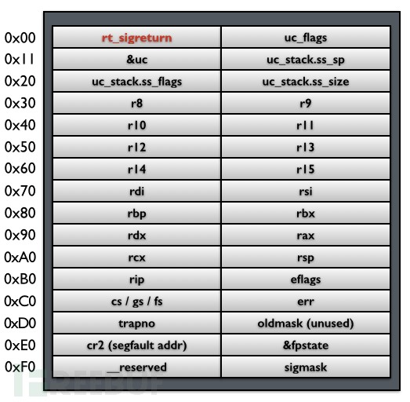
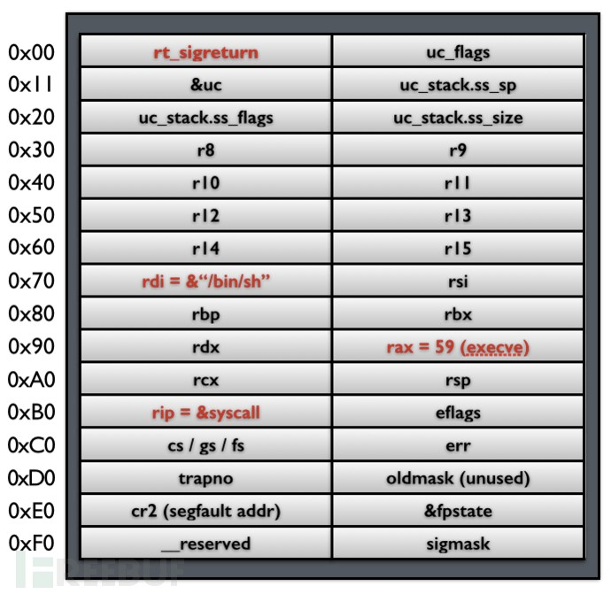
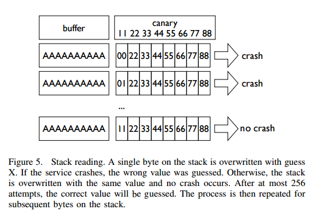

---
presentation:
  width: 1600
  height: 900
  slideNumber: 'c/t'
  showSlideNumber: "all"
  center: true
  enableSpeakerNotes: true
  theme: none.css
---

<!-- slide data-notes="" -->
# 二进制漏洞挖掘与利用
### DEP与DEP Bypass
<!-- slide data-notes="" -->
## NX/DEP
NX/DEP保护，即数据段不可执行保护，是针对栈溢出攻击而产生的一项防护措施。简单的来说，当开启这种保护时，堆栈上的指令将没有执行权限。所以，将shellcode写到栈上的简单的栈溢出攻击将会失效。


<!-- slide data-notes="" -->
## DEP绕过之ret2libc
不利用自己注入的代码，而用系统已有的代码来构造攻击
> system("/bin/sh")
* 特点
    - 通常指向系统共享库的代码 -> 执行不受NX/DEP影响

* 溢出形式
`buffer + system()的地址 + ret + binsh_addr`
`system()的地址`即系统共享库中system()的地址。
这里`ret`的值是执行玩system()后的返回地址，并不重要，可以为任意值。
`binsh_addr()`作为system()的参数，调用后拉起shell。

<!-- slide data-notes="" -->
## 如果有ASLR保护？
地址空间配置随机载入（英语：Address space layout randomization，缩写ASLR，又称位址空间配置随机化、位址空间布局随机化）是一种防范内存损坏漏洞被利用的计算机安全技术。位址空间配置随机载入利用随机方式配置资料定址空间，使某些敏感资料（例如作业系统内核）配置到一个恶意程式无法事先获知的位址，令攻击者难以进行攻击。（维基百科）

即使开启地址随机化，也不是全随机的。对于linux来说，开启ASLR，libc的基地址在每一次启动时都会变化，但是libc本身是整块存入内存的。即libc中指令相对于其基地址的偏移是不会变化的。而libc本身的指令是足够getshell的，所以要对抗ASLR，可以从泄露libc基地址下手。
<!-- slide data-notes="" -->
## 影响
- libc基地址变动
- gadgets的地址难以确认。
ldd <binary>查看libc地址，发现每一次都有变动。
```c#
~/Documents/pwnkr/bof $ ldd bof
	linux-gate.so.1 =>  (0xf7777000)
	libc.so.6 => /lib/i386-linux-gnu/libc.so.6 (0xf7599000)
	/lib/ld-linux.so.2 (0x5662b000)
~/Documents/pwnkr/bof $ ldd bof
	linux-gate.so.1 =>  (0xf7720000)
	libc.so.6 => /lib/i386-linux-gnu/libc.so.6 (0xf7542000)
~/Documents/pwnkr/bof $ ldd bof
	linux-gate.so.1 =>  (0xf775d000)
	libc.so.6 => /lib/i386-linux-gnu/libc.so.6 (0xf757f000)
	/lib/ld-linux.so.2 (0x565c1000)

```
<!-- slide data-notes="" -->
## ASLR应对方法
* 泄露libc地址
* for example
    - 用write(1,got.write(),4)打印write()函数的实际地址，通过偏移来算libc.so的基地址，进而算出system()的真实地址。
    - libc_addr = write_addr - write_offset
    - system_addr = libc_addr + system_offset

<!-- slide data-notes="" -->
## Memory Leak & DynELF
DynELF是pwntools提供的一个模块，可以帮助我们在没有libc文件时找到system()的地址。
* 使用
DynELF(leak,elf=ELF('<binary>')).lookup('system','libc')
leak，需要自己实现的函数，在此函数中至少要泄漏一个字节的内存。

* leak()的形式
```python
def leak(address):
  ...
  return data
```
* 还有"/bin/sh"
需要注意的是，DynElF无法搜索到"/bin/sh"的地址，这里可以用一个read()把"/bin/sh"写到bss段上。

<!-- slide data-notes="" -->
## DEP绕过之ROP
面向返回编程（Return-Oriented Programming，ROP）是计算机安全漏洞利用技术，该技术允许攻击者在安全防御的情况下执行代码，如不可执行的内存和代码签名。


<!-- slide data-notes="" -->

## 关于gadget
攻击者控制堆栈调用以劫持程序控制流并执行针对性的机器语言指令序列称为gadget。 
每一段gadget通常是结束于return指令，并位于共享库代码中的子程序。系列调用这些代码，攻击者可以在拥有更简单攻击防范的程序内执行任意操作。


<!-- slide data-notes="" -->
## 32位栈溢出和64位的区别
- 内存地址范围从32位增加到64位
- 函数参数的传递由压栈传参变成了先由寄存器传参，依次是RDI，RSI，RDX，RCX，R8和 R9，不够用时才会通过栈来传递
- 内存地址不大于0x00007fffffffffff，否则抛出异常。

* 64位下re2libc
    - buffer + pop_rdi_ret + binsh_addr + system()
    - 或者buffer + pop_rax_pop_rdi_call_rax + system() + binsh_addr
* 主要的gadget
    - 传参（pop xxx,ret）
    - 系统调用函数（`system()`，`exce()`）

<!-- slide data-notes="" -->
## 寻找gadget的工具
ROPgadeget
> $ ROPgadget --binary <binary> --only "pop|ret"
```c
~/Documents/pwnkr/bof $ ROPgadget --binary bof --only "pop|ret"
Gadgets information
============================================================
0x000005ee : pop ebp ; ret
0x00000624 : pop ebx ; pop ebp ; ret
0x000005ec : pop ebx ; pop esi ; pop ebp ; ret
0x0000070c : pop ebx ; pop esi ; pop edi ; pop ebp ; ret
0x000004a0 : pop ebx ; ret
0x0000070e : pop edi ; pop ebp ; ret
0x000005ed : pop esi ; pop ebp ; ret
0x0000070d : pop esi ; pop edi ; pop ebp ; ret
0x0000047f : ret

Unique gadgets found: 9
```
程序比较小时，gadget的数量也不多，也可以考虑搜索libc.so中的gadget，可用的很多。
<!-- slide data-notes="" -->
## Libc上的Gadget
能够泄漏libc基地址时，使用libc的gadget更加方便和容易，libc上可用的gadget就很丰富了。
```s
$ ROPgadget --binary /lib/i386-linux-gnu/libc.so.6  --only "pop|ret"
...
Unique gadgets found: 1226

```

<!-- slide data-notes="" -->
## ret2__libc_csu_init

`__libc_csu_init()`用于对libc进行初始化操作的函数，只要使用了libc函数就一定会有此函数出现，而绝大多数的程序都会调用libc的函数，即`__libc_csu_init()`广泛存在于linux程序中。
`__libc_csu_init()`中的gadget也可以作为通用gadget。
<!-- slide data-notes="" -->
## ret2__libc_csu_init
```c
.text:00000000004005C0 ; void _libc_csu_init(void)
.text:00000000004005C0                 public __libc_csu_init
.text:00000000004005C0 __libc_csu_init proc near               ; DATA XREF: _start+16o
.text:00000000004005C0                 push    r15
.text:00000000004005C2                 push    r14
.text:00000000004005C4                 mov     r15d, edi
.text:00000000004005C7                 push    r13
.text:00000000004005C9                 push    r12
.text:00000000004005CB                 lea     r12, __frame_dummy_init_array_entry
.text:00000000004005D2                 push    rbp
.text:00000000004005D3                 lea     rbp, __do_global_dtors_aux_fini_array_entry
.text:00000000004005DA                 push    rbx
.text:00000000004005DB                 mov     r14, rsi
.text:00000000004005DE                 mov     r13, rdx
.text:00000000004005E1                 sub     rbp, r12
.text:00000000004005E4                 sub     rsp, 8
.text:00000000004005E8                 sar     rbp, 3
.text:00000000004005EC                 call    _init_proc
.text:00000000004005F1                 test    rbp, rbp
.text:00000000004005F4                 jz      short loc_400616
.text:00000000004005F6                 xor     ebx, ebx
.text:00000000004005F8                 nop     dword ptr [rax+rax+00000000h]
.text:0000000000400600
.text:0000000000400600 loc_400600:                             ; CODE XREF: __libc_csu_init+54j
.text:0000000000400600                 mov     rdx, r13
.text:0000000000400603                 mov     rsi, r14
.text:0000000000400606                 mov     edi, r15d
.text:0000000000400609                 call    qword ptr [r12+rbx*8]
.text:000000000040060D                 add     rbx, 1
.text:0000000000400611                 cmp     rbx, rbp
.text:0000000000400614                 jnz     short loc_400600
.text:0000000000400616

```

<!-- slide data-notes="" -->
## ret2__libc_csu_init
```c
.text:0000000000400616 loc_400616:                             ; CODE XREF: __libc_csu_init+34j
.text:0000000000400616                 add     rsp, 8
.text:000000000040061A                 pop     rbx
.text:000000000040061B                 pop     rbp
.text:000000000040061C                 pop     r12
.text:000000000040061E                 pop     r13
.text:0000000000400620                 pop     r14
.text:0000000000400622                 pop     r15
.text:0000000000400624                 retn
.text:0000000000400624 __libc_csu_init endp
```

- 最后连续的6个pop，可以用栈溢出控制`rbx`，`rbp`，`r12`，`r13`，`r14`，`r15`
- 之后从400600开始可以控制到`rdi`（通过`edi`），`rsi`，`rdx`的值，并`call[r12+rbx*8]`。
通过上面的调用可以控制到三个传递参数的寄存器，并且执行一次call，完成ret2libc。
<!-- slide data-notes="" -->
## SROP
SROP (Sigreturn Oriented Programming)

signal机制是一套被广泛应用于unix的机制，它通常用于系统在用户态和内核态切换，执行如杀死进程，设置进程定时器等功能。
如图所示，内核向进程发起signal。进程挂起，进入内核（1），内核为进程保存上下文，跳到signal handler，之后又返回内核态，上下文恢复，最后返回最初的进程。
<!-- slide data-notes="" -->
## SROP
重点在第二步和第三步上，我们可以把signal handler理解为一个特殊的函数，这个函数返回地址是rt_sigreturn，在执行完signal handler，会返回到rt_sigretrun，而rt_sigreturn会将上下文参数恢复。下图是linux系统保存在栈上的上下文信息。

<!-- slide data-notes="" -->
## SROP
<div id="left">

可以看到，寄存器的值作为上下文信息的一部分被保存在了栈上，而在rt_sigreturn 执行时又会把寄存器的值从栈上复制到寄存器中，从而恢复用户进程挂起之前的状态。其中，内核为用户恢复上下文时不会对栈上的上下文信息进行检查。意即，我们完全可以通过栈溢出伪造一个存储上下文信息的栈，通过rt_sigreturn将栈上的数据放到寄存器中。如下图
</div>
<div id="right">


</div>

<!-- slide data-notes="" -->
## system call chains
那么此时当rt_sigreturn 执行完毕后，随后就会执行rip指向的`syscall()`，并且以rax和rdi为参数。明显的，这个函数调用会弹出一个shell，攻击完成。
如果栈上存放的rip指向的地址不仅仅是`syscall()`而是`syscall(),ret`的gadget，并且控制栈指针指向另一个Fake Signal Frame，可以生成一系列的signal调用。
<div class="middle">


</div>

<!-- slide data-notes="" -->
## BROP (blind rop)
BROP与其说是rop技巧，更不如说是寻找gadget的技巧，它的特长在于，可以在没有源程序的情况下寻找有效的gadget，是一种适用于远程攻击的rop，针对的是64位系统。
* 攻击条件
在前面我们提到了aslr保护，也就是地址随机化保护，在远程服务器中，服务器端的程序进程崩溃之后会自动重新启动。而对于大部分服务器应用来说，崩溃后重启的地址与崩溃前一样，也就是说虽然服务器端开启了额aslr保护，但只会在第一次启动时生效，崩溃后的重启并不会再次启用aslr随机化。当我们遇到这种远程程序的时候，可以反复进行崩溃尝试而不必担心aslr的影响。
<!-- slide data-notes="" -->
## stack reading
用于绕过canary保护
> canary（金丝雀）
> 过去由于缺少气体环境的检测工具，煤矿工人会带着金丝雀下矿洞，金丝雀对于周围气体非常敏感，如果金丝雀死亡，则说明有大量的危险气体，这时矿工就会撤离。
在现代操作系统中，canary是一种防止栈溢出的保护机制，在开辟函数栈时，会先在fs块内存中的某个地方读取值并存到栈上，当函数运行到返回之前，会先检查当前栈上的数据与一开始从fs块上读取的值是否相同（通常是一个异或比较），若不同，则认为程序被栈溢出攻击，直接崩溃。狭义的来说，栈上一开始保存的数据，被我们称为canary。需要注意的是，canary的最低一位一般为“/x00”，这是为了防止canary被一些可以打印栈上数据的漏洞泄露。
* 必要条件,崩溃后的重启不会改变canary的值。
* 开启canary保护时栈上的布局,` Buffer|canary|pre ebp|ret`
<!-- slide data-notes="" -->
## 覆盖canary
32位系统下canary长度一般为4个字节，64位下则是8个字节。
进行爆破尝试时，如果仅仅是枚举所有可能的数值，则最多需要尝试4294967296（FFFF+1）次，无疑时非常低效的。
<div id="left">

* 改进
为了提升效率，我们可以采用逐字节爆破的方式，具体见图。对于逐字节爆破，最大尝试次数仅为4*256=1024
</div>
<div id="right">


</div>
<!-- slide data-notes="" -->
## blind
这里的blind是指没有本地二进制文件或者源码的情况，即只有位于远程服务器端程序。
不同于本地二进制文件或源码，我们可以直接扫描本地内存获取gadget，远程服务器端的程序，我们很难找到有效的gadget。此时我们可以换个思路，先远程dump内存，利用write（）或者puts（）这类的输出函数来实现。
<!-- slide data-notes="" -->
## 寻找起write()和puts()参数的gadgets
这类gadgets一般形式是`pop xxx,ret`
* trap地址
当程序执行到这个地址时，程序会崩溃。这种地址很常见，内存中到处都是这类地址，一个随机跳转的地址总是能引起程序崩溃。
* stop地址
区别于trap地址，当程序执行到这个地址时，程序会被挂起或者无限循环。
<!-- slide data-notes="" -->
## brop gadget
在libc_csu_init的结尾一段这样的指令

可以看到，这段指令的特殊之处在于它是连续6个pop接一个ret。这种结构非常少见，意即我们可以通过寻找这种结构的gadget来找到这段指令。由上图可以看到的是，这段brop gadget虽然只是对rbx，rbx，r12，r13，r14，r15进行pop然后ret，但是通过分析其机器码，若程序从偏移0x7开始执行，指令则变为pop rsi，pop r15，ret。若程序从偏移0x9开始执行，指令则变为pop rdi，ret。所以若找到这段brop gadget，我们便可以通过偏移找到起第一个和第二个函数参数的gadget。
<!-- slide data-notes="" -->
## 寻找brop gadget的地址
下面讲如何用trap地址和stop地址试探brop gadget的地址。我们把payload进行如下构造，`buffer+canary+rbp+ret+trap*6+stop+trap*n`。其中，buffer和rbp的值随意填，ret的值从0x400000开始枚举，一般情况下，由于我们是枚举地址，程序会崩溃。当程序并没有崩溃而是挂起，即无限循环时，记下此时的ret的值。枚举结束后，得到若干ret的值，这里需要注意，得到的ret值有可能不是brop gadget的地址而刚好是另一个stop地址。
如果是stop地址，把ret后所有地址都设为trap地址，若仍然会导致程序挂起，则确认是stop地址。

<!-- slide data-notes="" -->
## 第三个参数的gadget
* 对于puts()，此时的gadgets其实已经足够，但是对于write(),仍然需要一个起参数的gadget。
* `pop rdx,ret`难以寻找，用`strcmp()`代替。
    > `strcmp()`可以对rdx进行赋值。
* 最后
用puts()或者write()dump内存，寻找更多的gadgets来完成攻击。

<!-- slide class="middle"-->

# Thanks for watching!