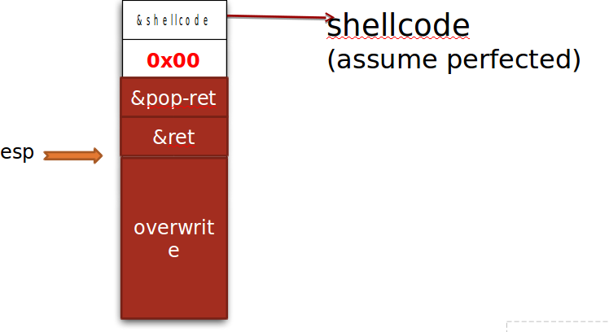

---
presentation:
  width: 1600
  height: 900
  slideNumber: 'c/t'
  showSlideNumber: "all"
  center: true
  enableSpeakerNotes: true
  theme: none.css
---


<!-- slide data-notes="" -->
# 二进制漏洞挖掘与利用
### ASLR保护
<!-- slide data-notes="" -->
## ASLR
位址空间配置随机载入（英语：Address Space Layout Randomization，缩写ASLR，又称位址空间配置随机化、位址空间布局随机化）是一种防范内存损坏漏洞被利用的计算机安全技术。位址空间配置随机载入利用随机方式配置资料定址空间，使某些敏感资料（例如作业系统内核）配置到一个恶意程式无法事先获知的位址，令攻击者难以进行攻击。（维基百科）

<!-- slide data-notes="" -->
## ASLR
```c
lometsj@ubuntu:~$ ldd test
	linux-gate.so.1 =>  (0xf7f1a000)
	libc.so.6 => /lib/i386-linux-gnu/libc.so.6 (0xf7d40000)
	/lib/ld-linux.so.2 (0xf7f1c000)
lometsj@ubuntu:~$ ldd test
	linux-gate.so.1 =>  (0xf7f0c000)
	libc.so.6 => /lib/i386-linux-gnu/libc.so.6 (0xf7d32000)
	/lib/ld-linux.so.2 (0xf7f0e000)
lometsj@ubuntu:~$ ldd test
	linux-gate.so.1 =>  (0xf7f37000)
	libc.so.6 => /lib/i386-linux-gnu/libc.so.6 (0xf7d5d000)
	/lib/ld-linux.so.2 (0xf7f39000)
lometsj@ubuntu:~$ ldd test
	linux-gate.so.1 =>  (0xf7f2c000)
	libc.so.6 => /lib/i386-linux-gnu/libc.so.6 (0xf7d52000)
	/lib/ld-linux.so.2 (0xf7f2e000)
```
<!-- slide data-notes="" -->
## ASLR
传统攻击需要精确的地址
- 基础栈溢出：需要定位shellcode
- return-to-libc： 需要libc地址
问题：程序的内存布局是固定的
解决方案：随机化每个区域的地址
<!-- slide data-notes="" -->
## ASLR
Aspect|aslr
----|----
表现|优异-每次加载都会随机
发布|获得内核支持，不需要重新编译
兼容性|对安全应用程序透明（位置独立）
保护效果|64位下效果显著
<!-- slide data-notes="" -->
## ASLR
### unbuntu-ASLR默认开启
```
$ cat /proc/sys/kernel/randomize_va_space
2
```
该值为：
- `1`: 随机化对战，VDSO，共享内存区域的位置
- `2`: 同上，并添加数据段的随机
- `0`: 禁用ASLR

<!-- slide data-notes="" -->
## 暴力绕过
- 使用大量NOP填充shellcode，提高地址命中率，并暴力搜索栈的地址
payload： nop*n + shellcode


<!-- slide data-notes="" -->
## ret2text
text段有可以执行的程序代码，并且地址不会被除PIE之外的ASLR随机化
可以将程序执行流劫持到意外的（但已经存在）的程序函数
<!-- slide data-notes="" -->
## 函数指针劫持
覆盖一个函数指针指向：
- 程序函数
- 程序连接表中的其他库函数
```c
int secret(char *input){... }
int chk_pwd(char *input){... }

int main()
{
	int (*ptr)(char *input);
	char buf[8];

	ptr = &chk_pwd;
	strncpy(buf,argv[1],12);
	printf("hello %s!\n",buf);

	(*ptr)(argv[2]);
}
```
<!-- slide data-notes="" -->
## ret2eax

```c
void msglog(char *input) {
    char buf[64];
    strcpy(buf, input);      //<---------返回值是一个存储在eax的指向buf的指针
}

int main(int argc, char *argv[]) {
    if(argc != 2) {
        printf("exploitme <msg>\n");
        return -1;
    }

    msglog(argv[1]);

    return 0;
}
```
随后，调用*eax就会把程序控制流劫持到buf上

<!-- slide data-notes="" -->
## ret2ret
如果栈上有一个函数指针需要被执行，可以考虑这个`ret = pop eip；jmp eip`；
```
&shellcode
&ret
&ret
&ret
overwrite
```
```c
void f(char *str) {
   char buffer[256];
   strcpy(buffer, str);
}

int main(int argc, char *argv[]) {
   int no = 1;
   int *ptr = &no;
   f(argv[1]);
}
```
<!-- slide data-notes="" -->
## ret2pop
返回到一个地址，执行的命令为`pop xxx,ret`，在栈上布置要返回的函数和参数。

<!-- slide data-notes="" -->
## 其他不会被随机化的段
lazy binding：动态链接库在加载时才被链接
*  两个重要的数据结构
    - 全局偏移表（GOT）
    - plt表
    - 一般在编译时就确定了位置
<!-- slide data-notes="" -->
## 动态链接
* 第一次运行函数
函数先跳转到plt表，从plt表跳转到got表，got表中存储的是该函数在plt表中的地址+4偏移，于是又跳转到plt下，执行push xx，jmp <got [0]>，其中push是给检索函数提供参数，jmp到got表的检索函数，此时got表中就会填充函数的准确地址
```c
#include <stdio.h>

int main()
{
        printf("hello world\n");
        return 0;
}

```
<!-- slide data-notes="" -->
## 动态链接
```c
pwndbg> disass main
Dump of assembler code for function main:
   0x0000000000400526 <+0>:	push   rbp
   0x0000000000400527 <+1>:	mov    rbp,rsp
   0x000000000040052a <+4>:	mov    edi,0x4005c4
   0x000000000040052f <+9>:	call   0x400400 <puts@plt>
   0x0000000000400534 <+14>:	mov    eax,0x0
   0x0000000000400539 <+19>:	pop    rbp
   0x000000000040053a <+20>:	ret
End of assembler dump.
pwndbg> disass *0x400400
No function contains specified address.
pwndbg> disass 0x400400
Dump of assembler code for function puts@plt:
   0x0000000000400400 <+0>:	jmp    QWORD PTR [rip+0x200c12]        # 0x601018
   0x0000000000400406 <+6>:	push   0x0
   0x000000000040040b <+11>:	jmp    0x4003f0
End of assembler dump.
pwndbg> x 0x601018
0x601018:	0x00400406

```
<!-- slide data-notes="" -->
## 攻击链接过程
- GOT中存储的是函数在内存中的真实地址
- 利用方法
    - 覆盖got表中的地址，当程序运行某一个函数，实际执行的是另一个我们覆盖的函数。
    - e.g.:覆盖printf()为system()
<!-- slide class="middle"-->

# Thanks for watching!
