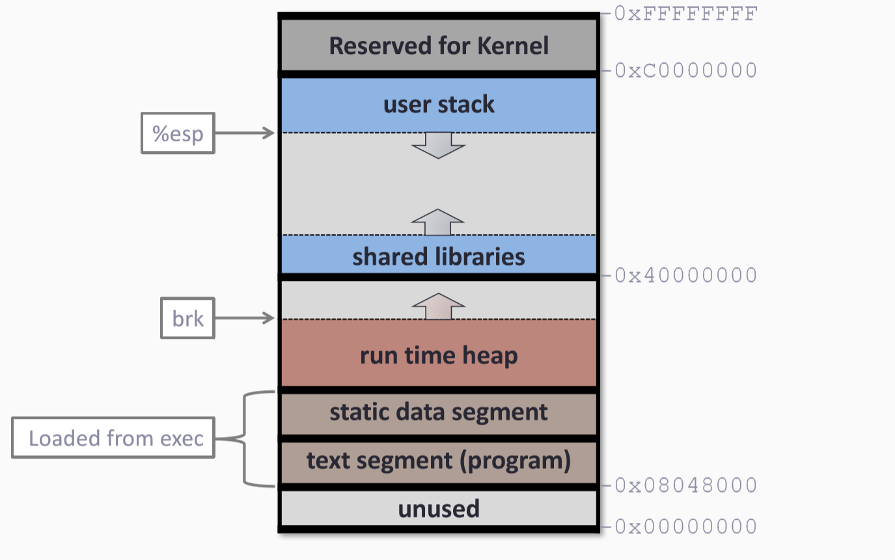
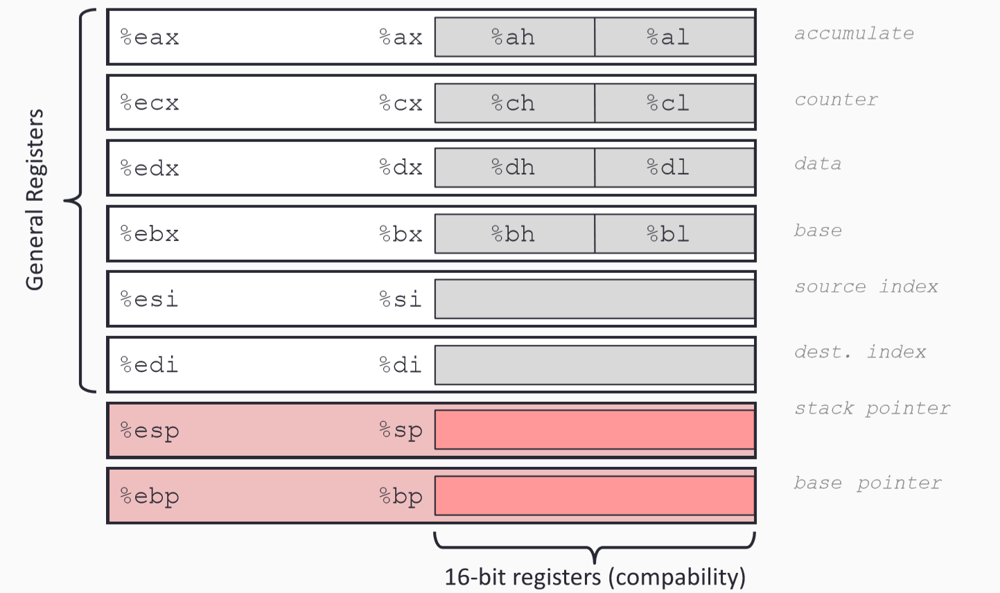
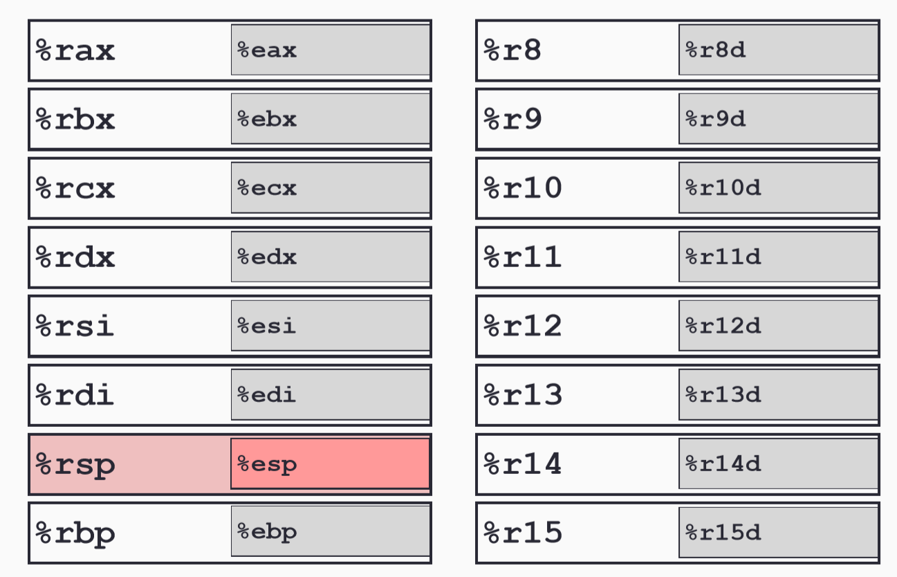

---
presentation:
  width: 1600
  height: 900
  slideNumber: 'c/t'
  showSlideNumber: "all"
  center: true
  enableSpeakerNotes: true
  theme: none.css
---


<!-- slide data-notes="" -->
# 二进制漏洞挖掘与利用
### 汇编语言与动态调试基础

<!-- slide data-notes="" -->
## 汇编基础（x86）
- 内存
- 寄存器：
  1. 普通:       EAX, EBX, ECX, EDX
                 ESI, EDI, EBP, ESP
  2. 段寄存器:    CS, DS, ES, FS, GS, SS
  3. 特殊寄存器:  <font color=red>EIP</font> , EFLAGS
- 指令
  1. push,pop
  2. add/sub/mul/div, xor, or
  3. mov, lea,
  4. test, cmp, jmp, call, <font color=red>ret</font>
<!-- slide data-notes="" -->
## Linux进程内存布局（32位）
<div id="left">

* 物理内存尺寸
    4GB ($2^{32}$) for x86, $2^{64}$ bytes for x64
* 内存中有什么
    - 可执行文件本身（代码+静态数据）
    - 相关库（代码+静态数据）
    - 运行时数据
      - heap
      - stack
    - 操作系统的代码和数据
</div>


<div id="right">


</div>
<!-- slide data-notes="" -->
## 栈 Stack
* 栈：一种数据结构
    - 先进后出
    - PUSH，POP
* 函数调用栈
    - 局部变量在函数结束后销毁
    - 每一个函数有一段在栈上的框架（栈帧）来保存它的数据（局部变量。。）
* 为什么使用栈？
    - 维护函数调用关系
    - main() -> foo() -> bar() -> foo()

<!-- slide data-notes="" -->
## Tips：为什么栈会反向增长
<div class="middle">


</div>
显然地，我们的习惯上比较接受的是从低地址向高地址增长的数据。

**NOTE**: 栈的反向增长令人困惑，但回溯历史便可以发现原因。早年计算内存空间很小，计算机需要同时在内存上维护栈和堆两个数据结构时，因为不好估计栈和堆的大小，最省事的方式就是把两个数据结构放在内存的两端，同时向中间增长，而栈一般就被放在了高地址，因而栈从高地址向低地址增长。有点像学生拿一个笔记本记两门课的笔记，一课从第一页开始记，另一课从最后一页开始记。
<!-- slide data-notes="" -->
## 函数调用栈
假定有调用：
main() -> foo() -> bar() -> foo()
```

                                foo
                       bar      bar       bar
              foo      foo      foo       foo      foo
     main --> main --> main --> main  --> main --> main --> main
```
<!-- slide data-notes="" -->
## 栈上的数据
EIP存储的是下一条要执行的指令的地址，所以若EIP的值被修改为我们期望的地址，函数运行到ret时，程序将会跳到修改后的地址运行指令。根据上面来看，在进入函数时，通常栈上的数据是这样的。可以看出，ESP永远指向栈顶的位置，而EBP则永远指向当前函数空间的栈底。
<div class="middle">


</div>
<!-- slide data-notes="" -->
## IA32寄存器
<div class="middle">


</div>
<!-- slide data-notes="" -->
## x86-64寄存器
<div class="middle">


</div>
<!-- slide data-notes="" -->
## 关键寄存器
* EIP：
    - 指向下一条要被执行的指令，cpu将从eip指向的地址获取指令
    - 不能被直接覆写
* ESP：
    - 指向栈顶
    - PUSH/POP操作都基于操作ESP

<!-- slide data-notes="" -->
## 基本指令
- 操作栈
  - push
  - pop
- 运算操作
  - add/sub/mul/div
  - xor/or
- 内存/寄存器操作
  - mov/lea
- 条件执行
  - test，cmp，jmp
  - jz，jnz，jg，ja
- 子程序调用
  - call，ret
<!-- slide data-notes="" -->
## 重要指令
* `call <function>`:执行目标函数
    - 把下一条指令（返回地址）压栈
    - 跳转到目标函数
    - 应该在函数调用完之后执行下一条指令

* ret：返回调用
    - 弹出（pop）栈顶，得到`返回地址`
    - 跳转到跳转到`返回地址`（通过改变EIP）
    - 应该跳转到调用方的下一条指令
<!-- slide data-notes="" -->
## 总的来看
### 函数调用时发生了什么（x86）
1.  传递参数
2.    call 函数地址（push eip，jmp 被调函数地址）
3.    ebp入栈，当前esp复制到ebp，esp减去一个数值，形成该函数的栈空间
4.    初始化局部变量（自动变量）
5.    运行函数指令
6.    返回值传递
7.    pop ebp
8.    ret（pop eip）
> 这里没有提到平衡栈帧的操作，实际上根据调用约定的不同，这个操作会在调用者或被调用者两个地方进行。
<!-- slide data-notes="" -->
## Intel 和 AT&T语法

<div id="left">

Intel Syntax | AT&T Syntax
---- | -----------------
`mov eax,1` |` movl $1, %eax`
`mov ebx, 0ffh` |  `movl $0xff, %ebx`
`int 80h` | `int $0x80`

</div>

<div id="right">

```
sum:
    push ebp
    mov ebp, esp
    mov eax, [ebp+12]
    add eax, [ebp+8]
    pop ebp
    retn
```

```
sum:
    pushl %ebp
    movl %esp,%ebp
    movl 12(%ebp),%eax
    addl 8(%ebp),%eax
    popl %ebp
    ret
```
</div>


<!-- slide data-notes="" -->
## INTEL 和 AT&T语法
Intel Syntax | AT&T Syntax
----: | :--------
AT&T 语法先写源操作数，再写目标操作数|Intel 语法先写目标操作数，再写源操作数：
AT&T 语法将操作数的大小表示在指令的后缀中（b、w、l）|Intel 语法将操作数的大小表示在操作数的前缀中（`BYTE PTR、WORD PTR、DWORD PTR`）
AT&T 语法总体上是offset(base, index, width)的格式|Intel 语法总体上是`[INDEX * WIDTH + BASE + OFFSET]`的格式
AT&T 语法用前缀表示数制（0x、0、0b）|Intel 语法用后缀表示数制（h、o、b）
AT&T 语法要在常数前加 `$`、在寄存器名前加 `%` 符号|Intel 语法没有相应的东西要加
<!-- slide data-notes="" -->

## 调试
程序执行速度非常快
Q：如果我要查看程序运行时发生了什么？
A：慢下来，一条指令一条指令执行
* 调试器
    - gdb
    - lldb
    - windbg
    - MSVC debugger
    - ollydbg
    - ...
<!-- slide data-notes="" -->
## gdb
### gdb指令（短/长）
-  r/run, c/continue
- s/step, n/next
- si, ni
- b/break
- bt/backtrace
- x, print, display, info
- ...
<!-- slide data-notes="" -->
## GDB调试器
* 开始
```sh
- gdb <program>:                   (gdb) run [arglist]
- gdb  --args program [arglist] :  (gdb) run
- gdb --pid <pid> :                (gdb) run
- gdb :                            (gdb) attach <pid>
```
* 结束
```sh
-  (gdb) quit
-  (gdb) Ctrl-d
```

<!-- slide data-notes="" -->
## GDB调试器
* `Breakpoints`: stops when executed
    - break function
    - break *addr
    - info break
    - clear function
    - delete/enable/disable [n]
* `Watchpoints`: stops when values changed
    - watch expr
    - info watch
<!-- slide data-notes="" -->
## GDB调试器
### 运行控制
- continue
- step： 向前移动一步（语句），在调用函数时进入被调用者
- stepi：向前移动一步（指令），在调用函数时进入被调用者
- next： 向前移动一步（语句），在调用函数时跳过被调用者
- nexti：向前移动一步（指令），在调用函数时跳过被调用者
<!-- slide data-notes="" -->
## GDB调试器
### 显示
<div id="left">

- print [/f] expr
  1. x 十六进制
  2. d 有符号十进制
  3. u 无符号十进制
  4. o 八进制
  5. t 二进制
  6. a 地址
  7. c character
  8. f 浮点数

- info reg [rn]
</div>

<div id="right">

- Display
    - x [/Nuf] expr
        - N count of units to display
        - u unit size
            - b 字节
            - h 双字
            - w 四字
            - g 八字节
        - f printing format
            - s 空字符结束的字符串
            - i 汇编指令
    - disassem [addr]
</div>
<!-- slide data-notes="" -->
## gdb demo
<div id="left">

- 检查机器码
- 设置断点
- 运行
- 检查执行过程中栈上的情况

</div>

<div id="right">

```c
user@box:~/test/bof$    gdb ./test
...
(gdb)    disassemble vulnerable
Dump    of    assembler    code    for    function    vulnerable:
0x080483f4    <vulnerable+0>:
push            %ebp
0x080483f5    <vulnerable+1>:
mov %esp,%ebp
0x080483f7    <vulnerable+3>:
sub                $0x38,%esp
...
0x0804840a    <vulnerable+22>: mov %eax,(%esp)
0x0804840d    <vulnerable+25>: call            0x8048310    <gets@plt>
...
(gdb)    break *0x0804840d
Breakpoint    1    at    0x804840d
(gdb)    run <  input
Starting    program:    /home/user/test/bof/test    <    input
Breakpoint    1,    0x0804840d    in    vulnerable    ()
(gdb)    x/20x    $esp
0xbffff730:0xbffff74c 0x08049630 0xbffff748 0x080482ec
0xbffff740:0xb7ff1040 0x08049630 0xbffff778 0x08048479
0xbffff750:0xb7fd8304 0xb7fd7ff4 0x08048460 0xbffff778
0xbffff760:0xb7ec55a5 0xb7ff1040 0xbffff778 0x0804843a
0xbffff770:0x08048460 0x00000000 0xbffff7f8 0xb7eacc76
```

</div>

<!-- slide data-notes="" -->
## 本章小结
* 背景知识
 - 汇编基础
 - 编译与链接
 - 内存布局
 - 调试基础

<!-- slide class="middle"-->
# Thanks for watching!
<!-- slide data-notes="" -->
