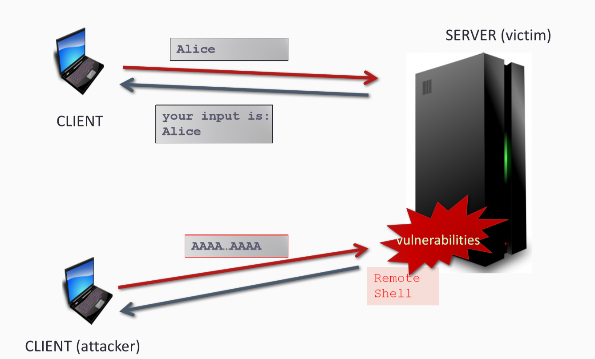
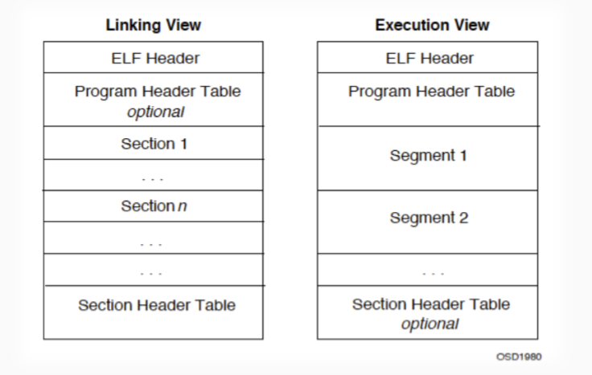

---
presentation:
  width: 1600
  height: 900
  slideNumber: 'c/t'
  showSlideNumber: "all"
  center: true
  enableSpeakerNotes: true
  theme: none.css
---

<!-- slide data-notes="" -->
# 背景知识

<!-- slide data-notes="" -->
## 什么是软件安全？
- 软件安全是为保护软件免受恶意攻击和其他黑客攻击而实施的一种想法，一遍让软件在潜在危险的情况下继续正常运行。--Technopedia
- 提供机密性，完整性和可用性是安全所必要的。--CIA
<!-- slide data-notes="" -->
## 软件安全
### 主题：二进制软件
- 源代码
- 字节码
- 本地代码
- 。。。
### 目标：保护软件免受攻击
- 通过安全的软件开发流程
- 通过发现二进制漏洞并修补
- 通过强化软件中的安全增强功能

<!-- slide data-notes="" -->
## 软件安全专题
- 逆向工程
- 程序分析
- 漏洞挖掘
- 程序强化
- 漏洞利用
- 。。。
<!-- slide data-notes="" -->
## 二进制漏洞
漏洞是安全问题的根源
### 二进制漏洞的分类
#### 逻辑漏洞：
- 输入合法性检查
- 认证
- 授权
- 访问控制
- 。。。
#### 内存破坏漏洞
- 栈溢出
- 堆溢出
- 整数溢出
- 格式化字符串
- UAF（ Use-after-free ）
- 。。。
<!-- slide data-notes="" -->
## 二进制漏洞的影响
<div id="left">

- ios 应用/内核 漏洞
- linux内核漏洞
- openssl 心脏出血
- 浏览器漏洞
- 代理服务器漏洞
- 路由器漏洞

</div>

<div id="right">

- iphone越狱
- linux提权，Android root
- 密钥泄露
- 远程代码执行
virus/worm/Trojan/backdoor/botnet 
- 远程代码执行
数据库损坏
- 网络流量劫持，中间人攻击
</div>

<!-- slide data-notes="" -->
## 远程代码执行
利用漏洞，向服务器发送精心构造的数据，从而控制程序执行流，得到远程shell。

shell：一个接收和处理用户命令的程序

<!-- slide data-notes="" -->
## 举个例子
```c
void vulnerable(){
    char name[20];

    printf("Please input name: ");
    gets(name);
    printf("your input is:%s, stored at %p \n",name,name);
}

int main(){
    vulnerable();
    return 0;
}

```
<!-- slide data-notes="" -->
## 举个例子
### gets()
从标准输入读取一行字符并将其存进作为参数的字符串数组中，直到遇到换行或EOF。换行符不会被复制进字符串，取而代之的是一个'\x00',以结束字符串。

## 举个例子
```c
void vulnerable(){
    char name[20];

    printf("Please input name: ");
    gets(name);//<-----------------------如果此时输入的数据大于19呢？
    printf("your input is:%s, stored at %p \n",name,name);
}

int main(){
    vulnerable();
    return 0;
}

```
<!-- slide data-notes="" -->
## 举个例子
## 如果此时输入的数据大于19
栈上的数据结构将被破坏。（临时变量name[20]被溢出）
栈：栈在程序的运行中有着举足轻重的作用。最重要的是栈保存了一个函数调用时所需要的维护信息，这常常称之为堆栈帧或者活动记录。堆栈帧一般包含如下几方面的信息：
1．函数的返回地址和参数
2． 临时变量：包括函数的非静态局部变量以及编译器自动生成的其他临时变量。

<!-- slide data-notes="ABI（Application Binary Interface）: 应用程序二进制接口 描述了应用程序和操作系统之间，一个应用和它的库之间，或者应用的组成部分之间的低接口。" -->
## 如何理解漏洞
### 了解ABI（应用程序二进制接口）
#### 可执行代码生成
- 编译
- 链接
#### 可执行文件结构
- PE(Windows)
- ELF(Linux)
#### 可执行文件的加载，动态加载
#### 可执行文件的运行时
- 内存布局
- 本地/汇编指令
- 调用约定
<!-- slide data-notes="" -->
## 从源代码到执行
```
                                                                           -----------
            编译（gcc -S）             汇编（as）
源代码（.cpp）----------->汇编代码（.asm）----------->目标文件（.o）--------> |可执行文件|
                                                        |                  |         |
                                                                            ---------     二进制/可执行
                                                        |ar                |         |
                                                        |                  |         |
                                                      静态库------------->  | 动态库  |
                                                              链接（ld）  -----------
```

<!-- slide data-notes="" -->
## 编译和链接
- 编译（gcc）：
把源代码翻译成汇编语言
- 汇编（as）：
1. 将汇编代码编码成本地指令
2. 对每个编译单元生成目标文件（目标文件之间的依赖关系丢失）
- 归档（ar）：
将一些目标文件整合成一个静态库（.a）
- 链接（ld）：
1. 解析目标文件之间的引用，并在必要时从静态库中提取对象
2. 生成可执行文件或共享库
- 加载/解释：
将可执行文件加载到内存中，并修复引用
<!-- slide data-notes="" -->
## 编译：从源码到汇编
```
int sum(int x, int y) 
{ 
    int t = x + y; 
    return t; 
}
```
```
sum: 
push ebp 
mov ebp, esp 
mov eax, [ebp+12] 
add eax, [ebp+8] 
pop ebp 
ret
```
```
00000000004004d6 <sum>:
  4004d6:	55                   	
  4004d7:	48 89 e5             	
  4004da:	89 7d ec             	
  4004dd:	89 75 e8             	
  4004e0:	8b 55 ec             	
  4004e3:	8b 45 e8             	
  4004e6:	01 d0                	
  4004e8:	89 45 fc             	
  4004eb:	8b 45 fc             	
  4004ee:	5d                   	
  4004ef:	c3                   	

```
<!-- slide data-notes="" -->

<div id="left">
## 可执行文件格式（ELF）
### ELF： Executable and Linkable Format 
### 三种类型的文件：
- 可重定位文件：gcc –c test.c => test.o (test.a) 
- 可执行文件：  gcc –o test test.c => test 
- 共享库文件：  test.so 
</div>

<div id="right">



</div>

<!-- slide data-notes="" -->
## ELF文件头
```
$ readelf -h /bin/ls
ELF Header:
  Magic:   7f 45 4c 46 02 01 01 00 00 00 00 00 00 00 00 00 
  Class:                             ELF64
  Data:                              2's complement, little endian
  Version:                           1 (current)
  OS/ABI:                            UNIX - System V
  ABI Version:                       0
  Type:                              EXEC (Executable file)
  Machine:                           Advanced Micro Devices X86-64
  Version:                           0x1
  Entry point address:               0x4049a0
  Start of program headers:          64 (bytes into file)
  Start of section headers:          124728 (bytes into file)
  Flags:                             0x0
  Size of this header:               64 (bytes)
  Size of program headers:           56 (bytes)
  Number of program headers:         9
  Size of section headers:           64 (bytes)
  Number of section headers:         29
  Section header string table index: 28

```
<!-- slide data-notes="" -->
```
$ readelf -S /bin/ls
There are 29 section headers, starting at offset 0x1e738:

Section Headers:
  [Nr] Name              Type             Address           Offset
       Size              EntSize          Flags  Link  Info  Align
  [ 0]                   NULL             0000000000000000  00000000
  [ 1] .interp           PROGBITS         0000000000400238  00000238
  [ 2] .note.ABI-tag     NOTE             0000000000400254  00000254
  [ 3] .note.gnu.build-i NOTE             0000000000400274  00000274
  [ 4] .gnu.hash         GNU_HASH         0000000000400298  00000298
  [ 5] .dynsym           DYNSYM           0000000000400358  00000358
  [ 6] .dynstr           STRTAB           0000000000401030  00001030
  [ 7] .gnu.version      VERSYM           000000000040160c  0000160c
  [ 8] .gnu.version_r    VERNEED          0000000000401720  00001720
  [ 9] .rela.dyn         RELA             0000000000401790  00001790
  [10] .rela.plt         RELA             0000000000401838  00001838
  [11] .init             PROGBITS         00000000004022b8  000022b8
  [12] .plt              PROGBITS         00000000004022e0  000022e0
  [13] .plt.got          PROGBITS         00000000004029f0  000029f0
  [14] .text             PROGBITS         0000000000402a00  00002a00
  [15] .fini             PROGBITS         0000000000413c5c  00013c5c
  [16] .rodata           PROGBITS         0000000000413c80  00013c80
  [17] .eh_frame_hdr     PROGBITS         000000000041a5f4  0001a5f4
  [18] .eh_frame         PROGBITS         000000000041adf8  0001adf8
  [19] .init_array       INIT_ARRAY       000000000061de00  0001de00
  [20] .fini_array       FINI_ARRAY       000000000061de08  0001de08
  [21] .jcr              PROGBITS         000000000061de10  0001de10
  [22] .dynamic          DYNAMIC          000000000061de18  0001de18
  [23] .got              PROGBITS         000000000061dff8  0001dff8
  [24] .got.plt          PROGBITS         000000000061e000  0001e000
  [25] .data             PROGBITS         000000000061e3a0  0001e3a0
  [26] .bss              NOBITS           000000000061e600  0001e600
  [27] .gnu_debuglink    PROGBITS         0000000000000000  0001e600
  [28] .shstrtab         STRTAB           0000000000000000  0001e634
```
<!-- slide data-notes="" -->
```
$ readelf -l /bin/ls

Elf file type is EXEC (Executable file)
Entry point 0x4049a0
There are 9 program headers, starting at offset 64

Program Headers:
  Type           Offset             VirtAddr           PhysAddr
                 FileSiz            MemSiz              Flags  Align
  PHDR           0x0000000000000040 0x0000000000400040 0x0000000000400040
                 0x00000000000001f8 0x00000000000001f8  R E    8
  INTERP         0x0000000000000238 0x0000000000400238 0x0000000000400238
                 0x000000000000001c 0x000000000000001c  R      1
      [Requesting program interpreter: /lib64/ld-linux-x86-64.so.2]
  LOAD           0x0000000000000000 0x0000000000400000 0x0000000000400000
                 0x000000000001da64 0x000000000001da64  R E    200000
  LOAD           0x000000000001de00 0x000000000061de00 0x000000000061de00
                 0x0000000000000800 0x0000000000001568  RW     200000
  DYNAMIC        0x000000000001de18 0x000000000061de18 0x000000000061de18
                 0x00000000000001e0 0x00000000000001e0  RW     8
  NOTE           0x0000000000000254 0x0000000000400254 0x0000000000400254
                 0x0000000000000044 0x0000000000000044  R      4
  GNU_EH_FRAME   0x000000000001a5f4 0x000000000041a5f4 0x000000000041a5f4
                 0x0000000000000804 0x0000000000000804  R      4
  GNU_STACK      0x0000000000000000 0x0000000000000000 0x0000000000000000
                 0x0000000000000000 0x0000000000000000  RW     10
  GNU_RELRO      0x000000000001de00 0x000000000061de00 0x000000000061de00
                 0x0000000000000200 0x0000000000000200  R      1

 Section to Segment mapping:
  Segment Sections...
   00     
   01     .interp 
   02     .interp .note.ABI-tag .note.gnu.build-id .gnu.hash .dynsym .dynstr .gnu.version .gnu.version_r .rela.dyn .rela.plt .init .plt .plt.got .text .fini .rodata .eh_frame_hdr .eh_frame 
   03     .init_array .fini_array .jcr .dynamic .got .got.plt .data .bss 
   04     .dynamic 
   05     .note.ABI-tag .note.gnu.build-id 
   06     .eh_frame_hdr 
   07     
   08     .init_array .fini_array .jcr .dynamic .got 

```
<!-- slide data-notes="" -->
## 冯·诺伊曼模型
存储程序计算机在体系结构上主要特点有：

- 以运算单元为中心
- 采用存储程序原理
- 存储器是按地址访问、线性编址的空间
- 控制流由指令流产生
- 指令由操作码和地址码组成
- 数据以二进制编码
<!-- slide data-notes="" -->

<!-- slide data-notes="" -->
