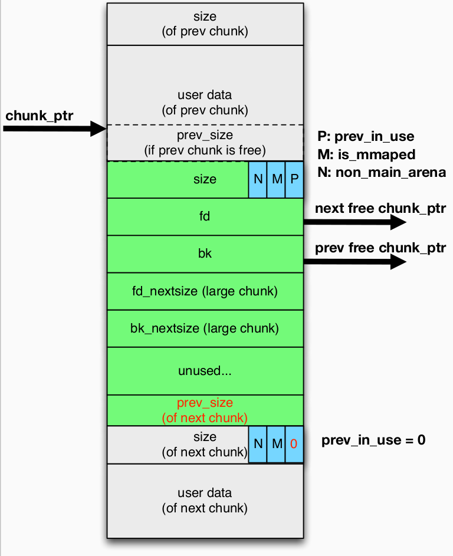
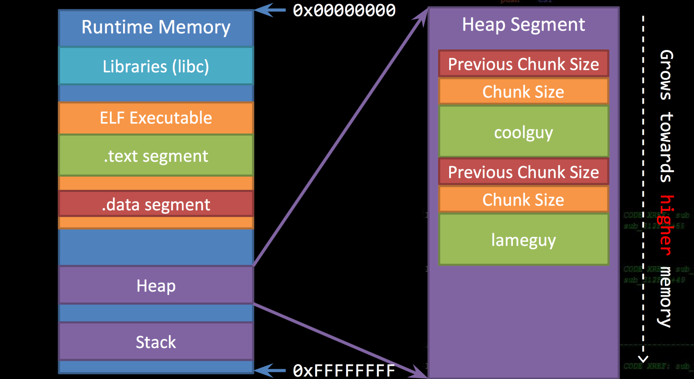
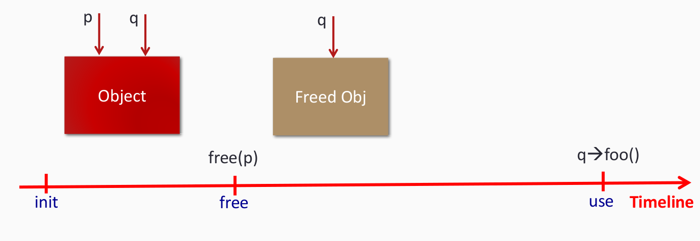
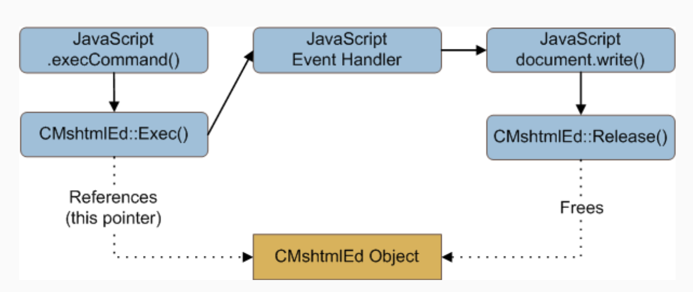
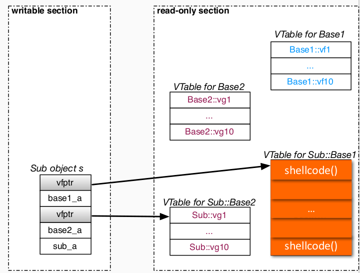
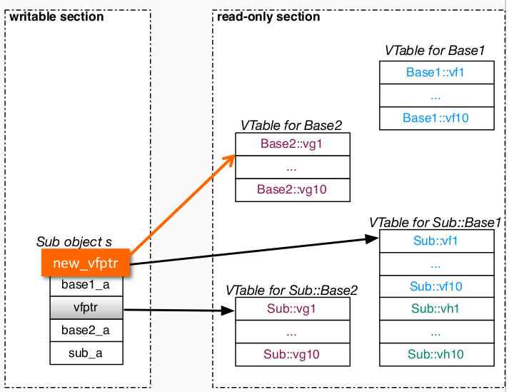
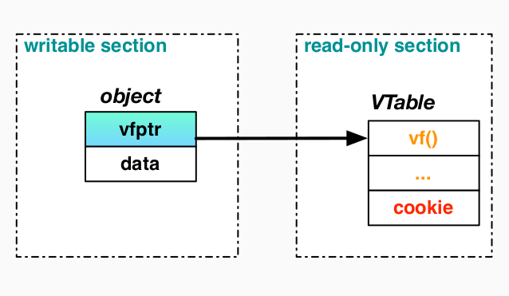

---
presentation:
  width: 1600
  height: 900
  slideNumber: 'c/t'
  showSlideNumber: "all"
  center: true
  enableSpeakerNotes: true
  theme: none.css
---


<!-- slide data-notes="" -->
# 二进制漏洞挖掘与利用
### 堆溢出利用

<!-- slide data-notes="" -->
## Glibc：Chunk In Use
<div id="left">


</div>

<div id="right">

* prev_size 区域
    - 属于前一个chunk
    - 如果前一个chunk是free状态（并且不在fastbin）就会被设置
* prev_in_use
    - 若前一个chunk是free状态（并且不在fastbin）则置0
* is_mmaped
    - 是否是通过mmap()产生的
* non_main_arena
- 这个 chunk 是否属于一个线程的 arena

</div>
<!-- slide data-notes="" -->

## Glibc:被释放的chunk

<div id="left">



</div>

<div id="right">

* 下一个chunk的prev_size
    - 这个free chunk的长度
* 下一个chunk的prev_in_use
    - 为0
* 但是
    - 如果这个被释放的chunk在fastbin这些东西就不会被设置

</div>

<!-- slide data-notes="" -->
## 堆溢出
* 基本上与栈溢出基本类似
* 栈溢出的目标
    - 返回地址
    - 保存在栈帧的指针
    - 局部函数变量
    - 异常句柄
    - 其他敏感数据
* 堆溢出的目标
    - 堆的元数据
    - 对象中的函数指针
    - 对象中的vtable指针
    - 其他敏感数据

<!-- slide data-notes="" -->
## 例子
```c
struct toystr()
{
    void (* message)(char *);
    char buffer[20];
}
```
```c
coolguy = malloc(sizeof(struct toystr))
lameguy = malloc(sizeof(struct toystr))

coolguy -> message = &print_cool;
lameguy -> message = &print_meh;

puts("Input coolguy's name:");
fgets(coolguy->fuffer,200,stdin);
coolguy->buffer[strcspn(coolguy->buffer,"\n")] = 0;

puts("Input lameguy's name:");
fgets(coolguy->fuffer,200,stdin);
coolguy->buffer[strcspn(coolguy->buffer,"\n")] = 0;

coolguy->message(coolguy->buffer);
lameguy->message(lameguy->buffer);
```
<!-- slide data-notes="" -->
## 例子
<div class="middle">


</div>
<!-- slide data-notes="" -->
## 例子
```c

coolguy = malloc(sizeof(struct toystr))
lameguy = malloc(sizeof(struct toystr))

coolguy -> message = &print_cool;
lameguy -> message = &print_meh;

puts("Input coolguy's name:");
fgets(coolguy->fuffer,200,stdin);
coolguy->buffer[strcspn(coolguy->buffer,"\n")] = 0;

puts("Input lameguy's name:");
fgets(coolguy->fuffer,200,stdin);
coolguy->buffer[strcspn(coolguy->buffer,"\n")] = 0;

coolguy->message(coolguy->buffer);
lameguy->message(lameguy->buffer);//<--------被溢出覆盖的函数指针
```
<!-- slide data-notes="" -->
## 思考
- 堆溢出有什么其他的利用方法？
     - ~~对象中的函数指针~~
     - 管理堆的元数据
     - VTable指针
<!-- slide data-notes="" -->
## 溢出一个正在被使用的chunk

<div id="left">


</div>

<div id="right">

* 溢出 p bit （prev_in_use）
    - 从0改变成1
        - 当这个chunk被free，前一个chunk不会被合并。
        * note：只有被free的chunk比fast-bin-size大时才会发生合并操作
    - 从1改变成0
        - 当这个chunk被free时，前一个chunk会被合并
        - Q1:前一个"free"状态chunk的大小？
        - Q2:什么时候会发生合并？
        - 如果合并的free chunk接下来被分配给其他对象，那么两个不同的对象会共享同一段内存

</div>

<!-- slide data-notes="" -->
## 溢出一个正在被使用的chunk

<div id="left">


</div>

<div id="right">

- 溢出 N bit （nom_main_arena）
    - 从0改变成1
        - 会标志其为non_main_arena，切换arena
        - 当这个chunk被释放，将会被添加到fastbin或者unsorted_bin
        - 指向fastbin/unsorted_bin的指针会更新

</div>

<!-- slide data-notes="" -->

## 溢出一个free chunk

- 溢出 P bit （prev_in_use）
    - 从1改变成0
        - Q1：如果被分配给对象，P bit会被堆管理器纠正吗？
        - Q2:如果这个chunk被其他free chunk合并了呢
        e.g.：该free chunk之后的chunk被释放，其会尝试向前面的chunk合并，得到一个非预期大小的free chunk
        - 这个free chunk可以在稍后分配新的对象，新的对象会和前面的chunk共享内存
        - Q3:如果这个chunk在bins之间移动？
    - 从0改变成1，前面的free chunk将不会被合并

> 被释放的堆快由arena/fastbin追踪记录
> 被释放的堆快可以在稍后分配给新的对象，或者被新的free chunk合并，或者按照 fastbin->unsorted_bin->smallbin/largebin的顺序移动


<!-- slide data-notes="" -->
## 溢出一个free chunk

<div id="left">


</div>

<div id="right">

- 溢出 N 区域（non_main_arena）
    - 从0改变成1
        会标志其为non_main_arena，切换arena
        - Q1：如果chunk被再次分配？
        - Q2：如果这个chunk被物理相邻的chunk合并？
        - Q3：如果这个堆块在bins间移动
    - 从0改变成1


</div>
<!-- slide data-notes="" -->

## 溢出一个free chunk

<div id="left">


</div>

<div id="right">

- 溢出 size 区域
    - 如果该chunk被分配？
    - 如果该chunk被物理相邻的chunk合并？
    - 如果这个chunk在bins间移动？


</div>

<!-- slide data-notes="" -->
## 溢出一个free chunk

<div id="left">


</div>

<div id="right">

- 溢出 fd/bk指针
    - 产生 unlink 问题

</div>

<!-- slide data-notes="" -->
## 溢出一个free chunk


- 溢出 prev_size 区域
    - 如果缩小prev_size
        - 当下一个chunk被释放时，会发生什么？
            - 会尝试合并当前chunk（的一部分）
            - 当前chunk（的一部分）将被unlink，导致unlink操作到假的fd/bk指针，并且当前 free chunk和合并的chunk重叠。
    - 如果放大prev_size
        - 当下一个chunk被释放时，会发生什么？
            - 会尝试合并当前chunk（大于实际）
            - （大于实际）的当前堆快将被unlink，导致unlink操作到假的fd/bk指针，并且前面（正在使用）的chunk会和新合并的free chunk共享内存


<!-- slide data-notes="" -->
## 溢出TOP chunk的size区域

<div id="left">


</div>

<div id="right">


- 缩小size
    - 浪费内存
- 放大size
    - 新的分配请求总是能被TOP chunk满足
    - 这个（比实际大的）TOP chunk可以覆盖包括 code/data,e.g.,got表，那么任意地址都可以被分配请求返回
</div>

<!-- slide data-notes="" -->
## 防御堆溢出
* cookie
    - 与StackGuard/GS（在返回地址附近插入cookie）类似，我们可以在堆对象附近插入cookie。
* 但是
    - 运行时开销非常大
    - 没有一个好的时间节点进行cookie检查：
        - 对于栈，在函数返回时进行检查
        - 对于堆，？
            - 一个还算合理的适当malloc/free被调用时进行检查，但其可能无法对被损害的对象进行操作。

<!-- slide data-notes="" -->
## 浏览器

- 由c++编写
- 代码量大，使用人数多

Google 1 : "80%	attacks	exploit	use-after-free...”
Microsoft 2 : 50% CVEs targeted Winows7 are UAF
>  https://gcc.gnu.org/wiki/cauldron2012?action=AttachFile&do=get&target=cmtice.pdf
>  http://download.microsoft.com/download/F/D/F/FDFBE532-91F2-4216-9916-2620967CEAF4/Software%20Vulnerability%20Exploitation%20Trends.pdf
<!-- slide data-notes="" -->
## Use-After-Free (UAF)
* 漏洞
    - 被释放的内存被<font color=Red>再次释放？</font>
    - 被释放的内存被<font color=Red>损坏？</font>
<div class="middle">


</div>


<!-- slide data-notes="" -->
## Use-After-Free (UAF)
* 攻击
最常见的UAF攻击：<font color=Red>VTable Hijacking</font>

<div class="middle">


</div>

<!-- slide data-notes="" -->
## MS12-063
Microsoft Internet ExplorerexecCommand Vulnerability Demo
<div class="middle">


</div>
<!-- slide data-notes="" -->
## UAF vulnerability(MS12-063)

<div class="middle">


</div>

<!-- slide data-notes="" -->
## UAF vulnerability(MS12-063)
<div class="middle">


</div>
<!-- slide data-notes="" -->
## 动态分配的VTable(c++)
<div id="left">


</div>

<div id="right">

```c
void foo(Base2* obj){
    obj->vg4();
}

void main(){
    Base2* obj = new Sub();
    foo(obj);
}
```
```assembly
code section
; Function main()
push SIZE
call malloc()
mov ecx, eax
call Sub::Sub()
; now ECX points to the Sub object
add ecx, 8
; now ECX points to the Sub::Base2 object
call foo()
ret
; Function foo()
mov eax, [ecx]      ; read vfptr of Base2
mov edx, [eax+0x0C] ; get vg4() from vtable
call edx            ; call Base2::vg4()
ret
```
</div>

<!-- slide data-notes="" -->
## VTable Hijacking 分类
<div id="right">

- <font color=Red>损坏VTable</font>
    - 覆盖VTable
- VTable注入
    - 覆盖vfptr
    - 指向假的VTable
- VTable
    - 覆盖vfptr
    - 指向包括VTable，数据等。。
</div>

<div id="left">



</div>

<!-- slide data-notes="" -->
## VTable Hijacking 分类
<div id="right">

- 损坏VTable
    - 覆盖VTable
- <font color=Red>VTable注入</font>
    - 覆盖vfptr
    - 指向假的VTable
- VTable
    - 覆盖vfptr
    - 指向包括VTable，数据等。。
</div>

<div id="left">


</div>

<!-- slide data-notes="" -->
## VTable Hijacking 分类
<div id="right">

- 损坏VTable
    - 覆盖VTable
- VTable注入
    - 覆盖vfptr
    - 指向假的VTable
- <font color=Red>VTable重用</font>
    - 覆盖vfptr
    - 指向包括VTable，数据等。。
</div>

<div id="left">



</div>

<!-- slide data-notes="" -->
## VTable Hijacking 实战

<div id="left">

- Pwn2Own 2014 firefox
- Pwn2Own 2014 chrome
- CVE-2014-1772 IE

```
code section
; Function main()
push SIZE
call malloc()
mov ecx, eax
call Sub::Sub()
; now ECX points to the Sub object
add ecx, 8
; now ECX points to the Sub::Base2 object
call foo()
ret
; Function foo()
mov eax, [ecx]      ; read vfptr of Base2
mov edx, [eax+0x0C] ; get vg4() from vtable
call edx            ; call Base2::vg4()
ret
```
</div>

<div id="right">


</div>

<!-- slide data-notes="" -->
## 防御VTable Hijacking
### VTint

-|Attack|Requirement|
----|----|----|----|
VTable 破坏|覆盖 VTable|VTable可写
VTable 注入|覆盖vfptr，指向被注入的VTable|VTable可写
VTable 重用|覆盖vfptr，指向包括VTable，数据|形似VTable的数据，包括VTable
<!-- slide data-notes="" -->
## VTint
-|Attack|Requirement|解决方案
----|----|----|----|
VTable 破坏|覆盖 VTable|VTable可写|VTable只读
VTable 注入|覆盖vfptr，指向被注入的VTable|VTable可写|VTable只读
VTable 重用|覆盖vfptr，指向包括VTable，数据|形似VTable的数据，包括VTable|不同的VTable/数据
<!-- slide data-notes="" -->
## VTint vs. DEP
<div id="left">

-|VTint
----|----
VTable 破坏|VTable只读
VTable 注入|VTable只读
VTable 重用|不同的VTable/数据

</div>

<div id="right">

-|DEP
----|----
VTable 破坏|只读的代码段
VTable 注入|只读的代码段(可写的段不会被执行)
VTable 重用|<font color=Red>NO</font>

</div>


- 与DEP的相同之处
    - 轻量级，可以是二进制可兼容的。
- 不同
    - 加固后，可攻击面更小

<!-- slide data-notes="" -->
## 二进制级防护：vfGuard
NDSS’15: Dynamic binary instrumentation
    - 在运行时检查虚拟调用指令（使用PIN）
    - 针对指令使用不同策略
* 优势
    - 易于扩展，去执行不同策略
* 劣势
    - 开销大（PIN的开销*118%）
    - 无法防御VTables重用攻击
<!-- slide data-notes="" -->
## 源代码级防护：vfGuard
* Microsoft IE10, Core Objects
    - 在VTable结束地方的特殊cookies
* 优势
    - 轻量级
* 劣势
    - 只防御核心对象Core Objects
    - 不能应付VTable注入
    - 信息泄漏
<div id="right">


</div>
<!-- slide data-notes="" -->
## 源代码级防护：SafeDispatch
<div id="left">

* NDSS’14, LLVM-based
    - 静态计算一系列合法目标
    - 根据计算结果进行动态验证
* 策略1: VTable Check
    * 劣势：
        - 编译阶段需要耗费大量时间去分析
        - 高运行时开销（~30%）
* 策略2: moethod Check
    * 劣势：
        - 编译阶段需要耗费大量时间去分析
        - 高运行时开销（~7%）

</div>

<div id="right">

```c
C *x = ...
ASSERT(VPTR(x) ∈ Valid(C));
x->foo();
```
```c
C *x = ...
vptr = *((FPTR**)x);
f    = *(vptr + 0);
ASSERT(f      ∈ ValidM(C,foo));
f(x)
```
</div>

<!-- slide data-notes="" -->
## 源代码级防护：Forward Edge CFI
* GCC-VTV [Usenix’14], whitelist-based
```c
C *x = ...
ASSERT(VPTR(x) ∈ Valid(C));
x->foo();
```
    - 在编译阶段计算一组不完整的合法目标
    - 在加载是通过初始化函数合并不完整的数据
    - 在运行时检验是否合法
* 优势
    - 支持增量构建
* 劣势
    - 运行时操作繁琐
<!-- slide data-notes="" -->
## 源代码级别的防护：RockJIT
* CCS’15, CFI-based
    - 在编译阶段收集类型信息
    - 根据收集到的信息计算加载时转移目标的等价类别
    - 更新CFI检查，在加载时只允许间接传输到一个等价类
* 优势
    - 支持增量构造
* 劣势
    - 加载时开销大

<!-- slide class="middle"-->

# Thanks for watching!
