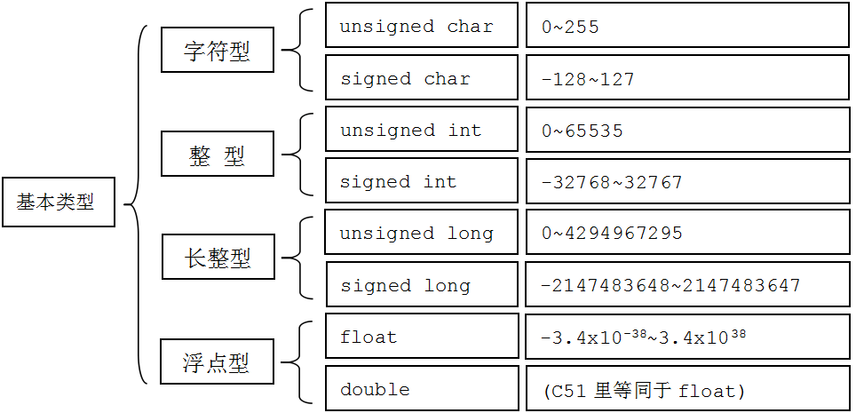

---
presentation:
  width: 1600
  height: 900
  slideNumber: 'c/t'
  showSlideNumber: "all"
  center: true
  enableSpeakerNotes: true
  theme: none.css
---


<!-- slide data-notes="" -->
# 整数溢出
<!-- slide data-notes="" -->
## 机器数和真值
### 0x00000000
最高位：符号位，1为负数，0为正数
```
0x00000011 = 3
0x10000011 = -3
0x00000001 = 1
0x10000001 = -1
机器数        真值
```
<!-- slide data-notes="" -->
## 原码, 反码, 补码
原码, 反码, 补码是机器存储一个具体数字的编码方式。
### 原码
```
[+1]原 = 0000 0001

[-1]原 = 1000 0001
```
取值范围
```
[1111 1111 , 0111 1111]
```
即
```
[-127 , 127]
```
<!-- slide data-notes="" -->
## 原码, 反码, 补码
### 反码
正数的反码是其本身
负数的反码，符号位不变，其余取反
```
[+1] = [00000001]原 = [00000001]反

[-1] = [10000001]原 = [11111110]反
```
<!-- slide data-notes="" -->

## 原码, 反码, 补码
### 补码
正数的补码是其本身
负数的补码在反码的基础上+1
```
[+1] = [00000001]原 = [00000001]反 = [00000001]补

[-1] = [10000001]原 = [11111110]反 = [11111111]补
```
<!-- slide data-notes="" -->
## c语言中的变量
```c
signed char  
  
short int  
  
int  
  
long int  
  
long long int  
  
typedef unsigned long       DWORD  
  
typedef int                BOOL  
  
typedef unsigned char       BYTE  
  
typedef unsigned short      WORD  
  
__int8, __int16, __int32, __int64  
  
ATOM  
  
BOOLEAN, BOOL  
  
BYTE  
  
CHAR  
  
DWORD, DWORDLONG, DWORD32, DWORD64  
  
WORD  
  
INT, INT32, INT64  
  
LONG, LONGLONG, LONG32, LONG64  
```
<!-- slide data-notes="" -->
## c语言中的变量

<!-- slide data-notes="" -->
## 问题
当运算超出范围时。。。。

无符号数：“溢出后的数会以2^(8*sizeof(type))作模运算”
有符号数：“undefined behavior”

<!-- slide data-notes="" -->

## 整数
### 有符号整数，无符号整数
```c
#include <stdio.h>

int main()
{
        int in;
        unsigned short out;

        scanf("%d",&in);
        out = in;
        printf("%d\n",out);
        return 0;
}
```
```
lometsj@ubuntu:~$ gcc int.c -o int
lometsj@ubuntu:~$ ./int
65535
65535
lometsj@ubuntu:~$ ./int
65536
0
lometsj@ubuntu:~$ ./int
65537
1
```
<!-- slide data-notes="" -->
## why?
int :4bytes  && short :2bytes

### 65535=0x0000FFFF----->0x~~0000~~FFFF = 65535
### 65536=0x00010001----->0x~~0001~~0001 = 1
### 65537=0x00010002----->0x~~0001~~0002 = 2
c语言的数字类型转换，在int->short时，是直接截断的。
<!-- slide data-notes="" -->
## 无符号数的下溢和上溢
### 下溢 0 - 1 = 0xffffffff
```c
bool fun(size_t size)
    if(size > 1024)return FALSE;
    else char *buf = new char[size - 1];
    memset(buf,0x90,size - 1)
```
这里是检查了数组的上限而没有检查下限，若size==0
对于memset的第三个参数，是无符号数类型，那么
size - 1 = 0xFFFFFFFF，系统显然会被崩溃

<!-- slide data-notes="" -->
## 无符号数的下溢和上溢
### 上溢 0xffffffff + 1 = 0
```c
bool fun(size_t size,char *s)
    if(size < 1)return FALSE;
    else char *buf = new char[size + 1];
    memcpy(buf,s,size);
    buf[size] = "\x00";
```
这里函数读取一个字符串，并将其复制到buf，末尾打上"\x00".若长度为0xffffffff，new分配的长度就会变成0，显然的，再执行memcpy就会发生栈溢出错误。
<!-- slide data-notes="" -->
## 符号问题
### 有符号数之间的比较
```c
int copy_something(char *buf, int len)    
{    
    char szBuf[800];    
    if(len > sizeof(szBuf))    
    {    
        return -1;    
    }    
    // 存在溢出隐患    
    return memcpy(szBuf, buf, len);    
}    
```
len为负数?
memcpy(szBuf, buf, <font color=Red>len</font>)
对于第三个参数来说，负数对应的无符号数非常大，显然会导致栈溢出。
<!-- slide data-notes="" -->
## 符号问题
### 截断 
```c
#include <stdio.h>

int main()
{
        int in;
        unsigned short out;

        scanf("%d",&in);
        out = in;
        printf("%d\n",out);
        return 0;
}
```
```
lometsj@ubuntu:~$ gcc int.c -o int
lometsj@ubuntu:~$ ./int
65535
65535
lometsj@ubuntu:~$ ./int
65536
0
lometsj@ubuntu:~$ ./int
65537
1
```
<!-- slide data-notes="" -->
## 危害
```c
short len = 0;

while(len < MAX_LEN)
{
    len += readFromInput(fd, buf);
    buf += len;
}
```
len + readFromInput(fd, buf) > 32767(溢出)
----> len + readFromInput(fd, buf)  实际的值小于0，通过`len < MAX_LEN`的检查
-------->程序死循环
<!-- slide data-notes="" -->
## OpenSSH Challenge-Response SKEY/BSD_AUTH 远程缓冲区溢出漏洞

auth2-challc.c:input_userauth_info_response()

```c
nresp = packet_get_int();
if (nresp > 0) {
    response = xmalloc(nresp*sizeof(char*));
    for (i = 0; i < nresp; i++)
        response[i] = packet_get_string(NULL);
}
```
`nresp*sizeof(char*)`溢出
nresp = 0x4000000 + 1
`nresp*sizeof(char*)` =  0x100000004 = 4

- 堆溢出
<!-- slide data-notes="" -->
##　判断溢出
### 加法
正数 + 正数 = 负数    <font color=Red>溢出</font>
### 乘法
积  / 除数 ！= 被除数  <font color=Red>溢出</font>

<!-- slide class="middle"-->

# Thanks for watching!