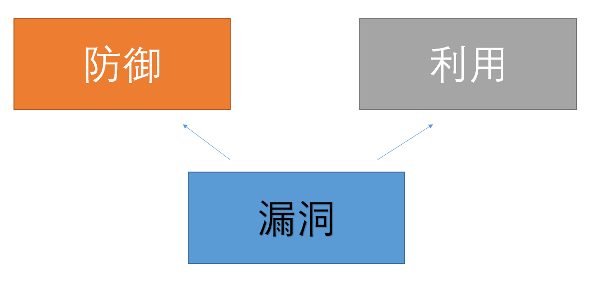
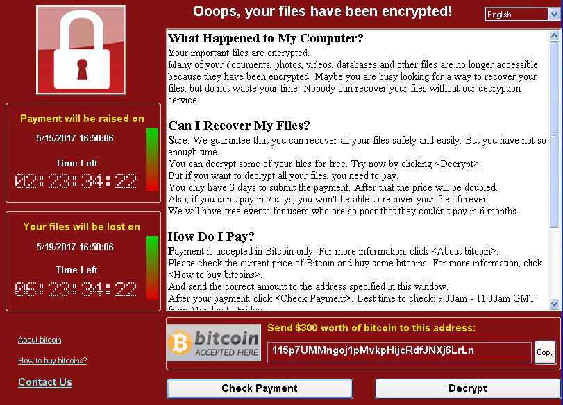
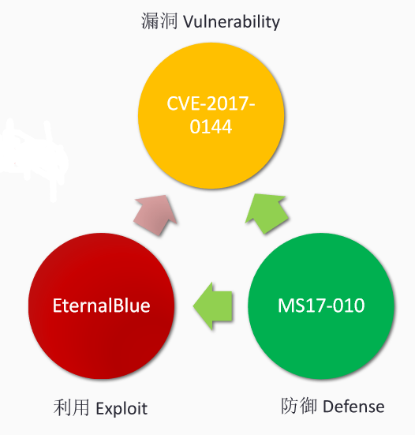
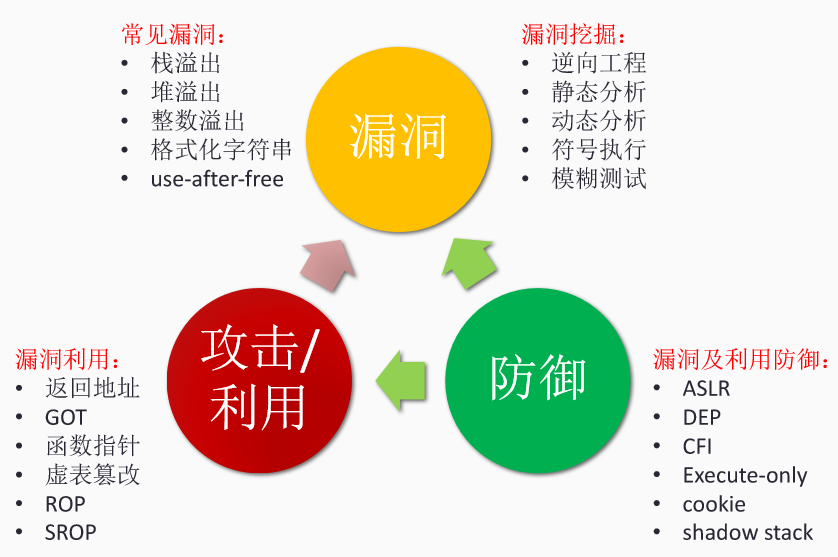

---
presentation:
  width: 1600
  height: 900
  slideNumber: 'c/t'
  showSlideNumber: "all"
  center: true
  enableSpeakerNotes: true
  theme: none.css
---

<!-- slide data-notes="" -->
# 二进制漏洞的挖掘与利用

<!-- slide data-notes="" -->
## 系统安全

<!-- slide data-notes="" -->
## 举个例子
### WannaCry

<!-- slide data-notes="" -->
## 举个例子
### 问题根源

<!-- slide data-notes="" -->
## 这门课的内容

<!-- slide data-notes="" -->
## 二进制漏洞的分类
- 栈溢出
- 堆溢出
- 格式化字符串
- 整数溢出
- 逻辑漏洞
- ....
<!-- slide data-notes="" -->
## 漏洞利用
- 构造攻击载体（钓鱼邮件，恶意网页）
- 触发程序漏洞（缓冲区溢出等）
- 篡改程序执行状态（代码，数据）
- 绕过现有防御（微观监控，宏观控制）
- 破坏计算机系统（病毒木马、勒索、泄密等）
<!-- slide data-notes="" -->
## 漏洞挖掘
- 手工测试
- fuzzing
- 静态分析
- 动态分析
<!-- slide data-notes="" -->
### 逆向分析
不能盲目分析整个程序，主要分析在：
- 输入输出
- 数据结构：栈，堆
- 程序执行流
<!-- slide data-notes="" -->
### 关键寄存器
- 指令寄存器
- 栈基质寄存器
- 栈顶寄存器
<!-- slide data-notes="" -->

## 工具
- 静态分析：IDA pro
- 动态调试：gdb-peda，windbg
- 脚本语言：python(pwntools，zio，ROPgadget)
- 模糊测试（fuzzing）:AFL
<!-- slide data-notes="" -->
## 基础
- 计算机原理：Memory, Registers, Stack... 
- 编程语言: C/C++, python 
- 操作系统：Linux

<!-- slide data-notes="" -->
## 实战方向
- 物联网安全：工业控制，智能汽车，智能家居
- window office
- 浏览器安全
- 。。。

<!-- slide data-notes="" -->
## 合法和道德
- 有时通过学习攻击来加强防御，但是学习攻击不能 损害他人或者违反法律 
- 在受控、授权的环境下攻击测试 
- 技术上可行的，未必是合法的、可以做的 
- 负责任的漏洞披露（有标准流程） 
- 为自己的行为负责
<!-- slide data-notes="" -->
## 参考
- Book 
    - Hacking: the art of exploitation
- Seed Project 
    - http://www.cis.syr.edu/~wedu/seed/
- blogs： 
    -  https://sploitfun.wordpress.com/2015/06/26/linux-x86exploit-development-tutorial-series/
- 训练平台： 
    - https://www.root-me.org/?lang=en
    - http://pwnable.kr/