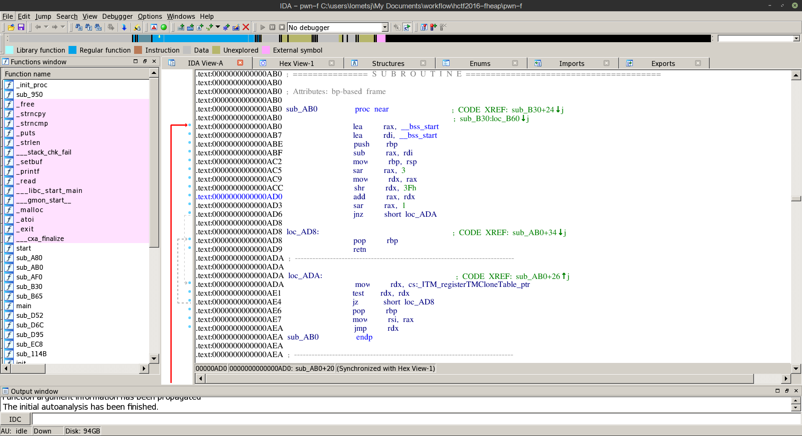
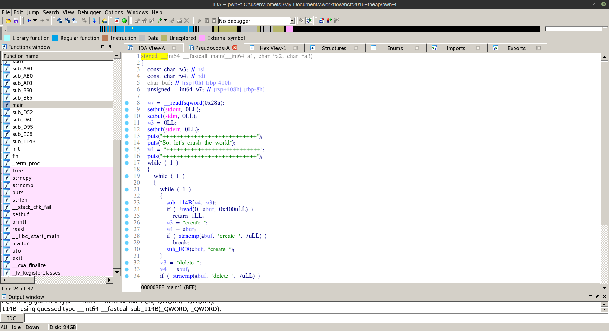

---
presentation:
  width: 1600
  height: 900
  slideNumber: 'c/t'
  showSlideNumber: "all"
  center: true
  enableSpeakerNotes: true
  theme: none.css
---

<!-- slide data-notes="" -->
# 二进制漏洞的挖掘与利用
<!-- slide data-notes="" -->
## 二进制漏洞的分类
- 栈溢出
- 堆溢出
- 格式化字符串
- 整数溢出
- 逻辑漏洞
<!-- slide data-notes="" -->
## 漏洞利用的目标
修改可执行程序的执行流，执行恶意代码。
## 漏洞挖掘
- 手工测试
- fuzzing
- 静态分析
- 动态分析
- ...
## 工具
- 静态分析：IDA pro
- 动态调试：gdb-peda，windbg
- 脚本语言：python(pwntools，zio，ROPgadget)
<!-- slide data-notes="" -->
### IDA pro
静态分析利器，目前最棒的反编译软件，支持多种指令集。

<!-- slide data-notes="" -->
F5大法

<!-- slide data-notes="" -->
## 前置技能
- 汇编语言：基本指令（intel,arm,mips），函数调用栈
- 编译，链接，装载，库，执行
- windows：pe文件结构  linux：ELF文件结构
- ...
<!-- slide data-notes="" -->
### 工具安装
- gdb-peda：
```shell
$ git clone https://github.com/longld/peda.git ~/peda
$ echo "source ~/peda/peda.py" >> ~/.gdbinit 
```
安装成功：
```shell
$ gdb
GNU gdb (Ubuntu 7.11.1-0ubuntu1~16.5) 7.11.1
Copyright (C) 2016 Free Software Foundation, Inc.
License GPLv3+: GNU GPL version 3 or later <http://gnu.org/licenses/gpl.html>
This is free software: you are free to change and redistribute it.
There is NO WARRANTY, to the extent permitted by law.  Type "show copying"
and "show warranty" for details.
This GDB was configured as "x86_64-linux-gnu".
Type "show configuration" for configuration details.
For bug reporting instructions, please see:
<http://www.gnu.org/software/gdb/bugs/>.
Find the GDB manual and other documentation resources online at:
<http://www.gnu.org/software/gdb/documentation/>.
For help, type "help".
Type "apropos word" to search for commands related to "word".
gdb-peda$ 

```
<!-- slide data-notes="" -->
- pwntools：
```
sudo apt-get install libffi-dev
sudo apt-get install libssl-dev
sudo apt-get install python
sudo apt-get install python-pip
pip install pwntools
```
安装成功：
```
$ python
Python 2.7.12 (default, Dec  4 2017, 14:50:18) 
[GCC 5.4.0 20160609] on linux2
Type "help", "copyright", "credits" or "license" for more information.
>>> from pwn import *
>>> 
```
<!-- slide data-notes="" -->
### 逆向分析
不能盲目分析整个程序，主要分析在：
- 输入输出
- 数据结构：栈，堆
- 程序执行流
<!-- slide data-notes="" -->
### 关键寄存器
- 指令寄存器
- 栈基质寄存器
- 栈顶寄存器
<!-- slide data-notes="" -->
## 实战方向
- 物联网安全：工业控制，智能汽车，智能家居
- window office
- 浏览器安全
- ...
<!-- slide data-notes="" -->
### CVE-2015-3036
linux内核模块KCodes NetUSB的漏洞，在函数run_init_sbus()下有栈溢出漏洞，远程攻击者通过tcp端口20005上发送较长的计算机名即发生栈溢出，执行任意代码。
影响范围很广，包括netgear，tp-link等产品。
<!-- slide data-notes="" -->
### CVE-2015-1641
microsoft word解析docx文档时，由于对displacedByCustomXML属性的customXML对象没有验证，导致可以传入其他标签的对象，可以实现任意内存写，最终导远程任意代码执行。
<!-- slide data-notes="" -->

