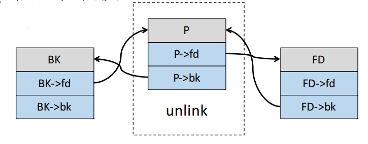

---
presentation:
  width: 1600
  height: 900
  slideNumber: 'c/t'
  showSlideNumber: "all"
  center: true
  enableSpeakerNotes: true
  theme: none.css
---

<!-- slide data-notes="" -->
#堆溢出攻击
与栈相对的，堆是由低地址向高地址增长的。类似于栈，堆也是现代操作系统常用的缓冲区，堆一般在程序运行时由系统动态分配，使用后由系统动态回收，当遇到危险函数时，堆的数据也可能会发生溢出。同时我们可以注意到，因为堆上不会保存eip这类的寄存器数据，我们无法通过堆溢出直接控制程序的执行，所以堆溢出攻击相对于栈溢出攻击更为复杂和抽象。
<!-- slide data-notes="" -->
##堆的结构
堆的基本单位是一个一个chunk块，chunk的结构如下：
```c#
struct malloc_chunk {
    INTERNAL_SIZE_T    prev_size;  /* Size of previous chunk (if free).  */
    INTERNAL_SIZE_T    size;     /* Size in bytes, including overhead. */
    struct malloc_chunk* fd;       /* double links -- used only if free. */
    struct malloc_chunk* bk;
    /* Only used for large blocks: pointer to next larger size.  */
    struct malloc_chunk* fd_nextsize; /* double links -- used only if free. */
    struct malloc_chunk* bk_nextsize;
 };
```

<!-- slide data-notes="" -->
如果前面的chunk是空闲状态，prev_size则记录前面chunk的大小
其中，size不同于pre_size的是，size中的低三位作为flag。
- 最低位:前一个 chunk 是否正在使用
- 倒数第二位:当前 chunk 是否是通过 mmap 方式产生的
- 倒数第三位:这个 chunk 是否属于一个线程的 arena 
<!-- slide data-notes="" -->
## top chunk
初次malloc()后，没有被分出去的堆。
## 堆的两种状态
- free
- allocted
<!-- slide data-notes="" -->
## unlink
unlink时free（）函数实现时所用到的一个宏，用于将当前free的chunk块相邻的chunk连接起来

<!-- slide data-notes="" -->
### unlink 代码
```c#
#define unlink( P, BK, FD ) 
{ 
BK = P->bk; 
FD = P->fd; 
FD->bk = BK; 
BK->fd = FD;
}
```
假设由两个连续分配的chunk，在堆上，它们的位置也是连续的。当对第一个chunk进行输入时，若发生溢出，溢出的数据是可以覆盖到第二个chunk的

<!-- slide data-notes="" -->
### 攻击方式
若在溢出时将第二个chunk覆盖成如下：
Pre_size = 偶数值
Size = -4
fd = address – 12
bk = value
其中，-4的最低位为0，即表示前一个chunk正在被使用。
<!-- slide data-notes="" -->
### free()的过程
此时若有free（）函数来free第一个chunk的话，free（）会有以下步骤：
1.	尝试向上一个chunk合并，由于它是第一个chunk，所以这里不会合并。
2.	尝试向下一个chunk合并，要判断下一个chunk是否可以，free（）的做法是通过第三个chunk的size中的flag位来判断。Free（）要定位第三个chunk的size的位置，是通过第二个chunk+size来定位的，因为我们这里通过溢出把第二个chunk的size设置为了-4，所以free（）会把第二个chunk的pre_size误认为是第三个chunk的size，又因为我们这里把pre_size设置成偶数，即最低位为0，所以free（）会误以为第三个chunk的size最低位为0，进而认为第二个chunk是空闲状态，从而确认将第一个chunk和第二个chunk进行合并。（使第一个chunk也为free状态）

<!-- slide data-notes="" -->
### 攻击后的unlink
对应的，要完成合并，其中就会对第二个chunk进行unlink操作
1. FD = P->fd = address – 12
2. BK = P->bk = value
3. FD->bk =BK , 即 *(address-12+12) = BK = value（bk相对于chunk的偏移就是12，所以这里会有+12，下面同理）
4. BK->fd =FD , 即 *(except value + 8) = FD = addr – 12

<!-- slide data-notes="" -->
### 任意地址写
不难看到，通过unlink操作后，我们在address上写了value，实现了任意地址写。如果我们同时泄露了下面将用到的某个函数的got地址，将其值改写为shellcode的地址，当unlink完成并在接下来程序运行到那个函数时，就会跳转到shellcode运行，实现getshell。
实际上，堆溢出攻击大多都是通过实现任意地址写，覆盖got.plt表来达到攻击目的。
<!-- slide data-notes="" -->
## house of force
house of force 是关于top chunk的堆溢出攻击技术。top chunk是位于空闲内存最高处的一块内存，分配内存时系统会先从fastbin，small bins，large bins中寻找合适大小的chunk，如果都不能满足分配请求，ptmalloc就会从top chunk中割一块内存。
### 利用条件
- 可通过堆溢出覆盖top chunk 的size
- 可以控制请求的堆块大小
- 可以对请求的堆块写数据
<!-- slide data-notes="" -->
### 利用方法
控制请求的堆块大小，使分配的堆块地址为想要写的地址。
即计算当前top chunk与目标地址的长度，使请求的堆块长度为: target_address - top_chunk_address - len(chunk_head)

<!-- slide data-notes="" -->
其中，通过堆溢出使top chunk的size为最大FFFFFFFFFFFFFFFF，让系统认为top chunk总是足够大到可以完成分配。
```c#

victim = av->top;
size   = chunksize(victim);

if ((unsigned long) (size) >= (unsigned long) (nb + MINSIZE))
{
    remainder_size = size - nb;
    remainder      = chunk_at_offset(victim, nb);
    av->top        = remainder;
    set_head(victim, nb | PREV_INUSE |
            (av != &main_arena ? NON_MAIN_ARENA : 0));
    set_head(remainder, remainder_size | PREV_INUSE);
 
    check_malloced_chunk(av, victim, nb);
    void *p = chunk2mem(victim);
    alloc_perturb(p, bytes);
    return p;
}
```
<!-- slide data-notes="" -->
## 堆喷
堆喷即heap spray，当我们可以向堆上不断写我们想要的东西时，可以尝试使用堆喷。需要注意的是，堆喷仅仅是一种写payload的手法，而不是一个漏洞。
### 利用条件
1.	能够向堆上申请大段的内存，能够控制堆上的数据。
2.	没有开启nx保护
3.	有一个可供利用的任意地址写的漏洞，比如上面说的hof，unlink。

<!-- slide data-notes="" -->
### slide code
执行slide code时程序不会做任何事情。
> 比如我们在栈溢出实验中，有经典的payload：buffer+ret+shellcode。如果我们并不能精确定位shellcode的地址，那么溢出攻击就会失败，这个时候不妨把payload改为buffer+ret+nop*n+shellcode。Nop是一个汇编指令，它的机器码为0x90（x86），程序执行nop不会做任何有效操作。当我们用大量的nop覆盖于ret和shellcode之间时，即使ret地址不够准确，但它有大概率会落在nop指令上（毕竟我们用的是大量nop指令）。如此，即使我们没有精准定位shellcode，程序依旧会在执行完nop后继续执行shellcode，达到getshell。
<!-- slide data-notes="" -->
既然我们可以在栈上这样布置，那么在堆上也可以同理。向堆上大量写入 `nop*n+shellcode`，再通过任意地址写的漏洞劫持eip到堆上的地址。因为是大量写入，大部分的堆空间都被写满了`nop*n+shellcode`，并且，`nop*n`的长度显著大于shellcode的长度，造成的结果是只要我们跳转到堆上的地址，有很大概率命中nop，这样shellcode就会执行。
<!-- slide data-notes="" -->
### 0x0c0c0c0c
这个地址常用于精准实现堆喷。从汇编上来讲，0C 0C   即OR AL,0C，所以它可以跟nop一样可以作为slidecode。其次0x0c0c0c0c很容易被堆覆盖0x0c0c0c0c = 202116108 ，202116108字节(b)=192.7529411兆字节(mb)
即大概200m的堆喷就可以保证能覆盖到它。假设用`0c*n+shellcode`堆喷，很容易就会在0xc0c0c0c0上写到“0xc0c0c0c0“，这时我们用任意地址写的漏洞，覆盖某个函数地址的值为‘0xc0c0c0c0’，eip经过几次跳转，仍然会跳转到0xc0c0c0c0上执行“0xc0c0c0c0“机器码，从而滑到shellcode上。

<!-- slide data-notes="" -->
<!-- slide data-notes="" -->
<!-- slide data-notes="" -->
<!-- slide data-notes="" -->
<!-- slide data-notes="" -->


