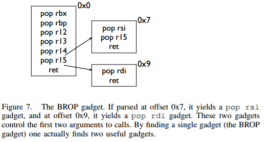

---
presentation:
  width: 1600
  height: 900
  slideNumber: 'c/t'
  showSlideNumber: "all"
  center: true
  enableSpeakerNotes: true
  theme: none.css
---

<!-- slide data-notes="" -->
## brop(blind rop)
Brop与其说是rop技巧，更不如说是寻找gadget的技巧，它的特长在于，可以在没有源程序的情况下寻找有效的gadget，是一种适用于远程攻击的rop，针对的是64位系统。
### 攻击条件
在前面我们提到了aslr保护，也就是地址随机化保护，在远程服务器中，服务器端的程序进程崩溃之后会自动重新启动。而对于大部分服务器应用来说，崩溃后重启的地址与崩溃前一样，也就是说虽然服务器端开启了额aslr保护，但只会在第一次启动时生效，崩溃后的重启并不会再次启用aslr随机化。当我们遇到这种远程程序的时候，可以反复进行崩溃尝试而不必担心aslr的影响。
<!-- slide data-notes="" -->
### stack reading
用于绕过canary保护
> canary（金丝雀）
> 过去由于缺少气体环境的检测工具，煤矿工人会带着金丝雀下矿洞，金丝雀对于周围气体非常敏感，如果金丝雀死亡，则说明有大量的危险气体，这时矿工就会撤离。
在现代操作系统中，canary是一种防止栈溢出的保护机制，在开辟函数栈时，会先在fs块内存中的某个地方读取值并存到栈上，当函数运行到返回之前，会先检查当前栈上的数据与一开始从fs块上读取的值是否相同（通常是一个异或比较），若不同，则认为程序被栈溢出攻击，直接崩溃。狭义的来说，栈上一开始保存的数据，被我们称为canary。需要注意的是，canary的最低一位一般为“/x00”，这是为了防止canary被一些可以打印栈上数据的漏洞泄露。
#### 必要条件
崩溃后的重启不会改变canary的值。
#### 开启canary保护时栈上的布局
Buffer|canary|pre ebp|ret
<!-- slide data-notes="" -->
#### 覆盖canary
32位系统下canary长度一般为4个字节，64位下则是8个字节。
进行爆破尝试时，如果仅仅是枚举所有可能的数值，则最多需要尝试4294967296（FFFF+1）次，无疑时非常低效的。
#### 改进
为了提升效率，我们可以采用逐字节爆破的方式，具体见上图。对于逐字节爆破，最大尝试次数仅为4*256=1024

<!-- slide data-notes="" -->
### blind
这里的blind是指没有本地二进制文件或者源码的情况，即只有位于远程服务器端程序。
不同于本地二进制文件或源码，我们可以直接扫描本地内存获取gadget，远程服务器端的程序，我们很难找到有效的gadget。此时我们可以换个思路，先远程dump内存，利用write（）或者puts（）这类的输出函数来实现。
<!-- slide data-notes="" -->
### 寻找起write()和puts()参数的gadgets
这类gadgets一般形式是pop xxx,ret
#### trap地址
当程序执行到这个地址时，程序会崩溃。这种地址很常见，内存中到处都是这类地址，一个随机跳转的地址总是能引起程序崩溃。
#### stop地址
区别于trap地址，当程序执行到这个地址时，程序会被挂起或者无限循环。
<!-- slide data-notes="" -->
#### brop gadget
在libc_csu_init的结尾一段这样的指令

可以看到，这段指令的特殊之处在于它是连续6个pop接一个ret。这种结构非常少见，意即我们可以通过寻找这种结构的gadget来找到这段指令。由上图可以看到的是，这段brop gadget虽然只是对rbx，rbx，r12，r13，r14，r15进行pop然后ret，但是通过分析其机器码，若程序从偏移0x7开始执行，指令则变为pop rsi，pop r15，ret。若程序从偏移0x9开始执行，指令则变为pop rdi，ret。所以若找到这段brop gadget，我们便可以通过偏移找到起第一个和第二个函数参数的gadget。
<!-- slide data-notes="" -->
#### 寻找brop gadget的地址
下面讲如何用trap地址和stop地址试探brop gadget的地址。我们把payload进行如下构造，buffer+canary+rbp+ret+trap*6+stop+trap*n。其中，buffer和rbp的值随意填，ret的值从0x400000开始枚举，一般情况下，由于我们是枚举地址，程序会崩溃。当程序并没有崩溃而是挂起，即无限循环时，记下此时的ret的值。枚举结束后，得到若干ret的值，这里需要注意，得到的ret值有可能不是brop gadget的地址而刚好是另一个stop地址。
如果是stop地址，把ret后所有地址都设为trap地址，若仍然会导致程序挂起，则确认是stop地址。

<!-- slide data-notes="" -->
#### 起第三个参数的gadget
pop rdx,ret
对于puts()，此时的gadgets其实已经足够，但是对于write(),仍然需要一个起参数的gadget。
pop rdx,ret难以寻找，用strcmp()代替。
> strcmp()可以对rdx进行赋值。
<!-- slide data-notes="" -->
### 最后
用puts()或者write()dump内存，寻找更多的gadgets来完成攻击。